# Что нового

История прошивок для владельца устройства. Свежие релизы сверху: номер, дата, что изменилось и скриншоты. Файлы: [Releases](https://github.com/TERMIN36/MeshCore/releases). Как пользоваться устройством: [README](README.md).

---

## v1.17.1-0.1.2

**Дата:** 25 сентября 2026  
**Скачать:** [релиз на GitHub](https://github.com/TERMIN36/MeshCore/releases/tag/v1.17.1-0.1.2)

На экране появились часы. Время можно поставить с телефона, взять с GPS или спросить у узла, который его уже знает. Сообщения можно читать без телефона: устройство само показывает входящие и хранит их на экране.

### Чтение без телефона

Companion работает автономно в режиме только чтения. Новое сообщение открывается на экране, телефон для этого не нужен и ответить с кнопки нельзя.

В памяти до 32 сообщений. Одно нажатие листает от старого к новому, двойное — страницы длинного текста. Долгое нажатие помечает очередь прочитанной и возвращает на главную, текст при этом остаётся. Долгое нажатие на главной открывает сохранённые сообщения снова, с самого старого. Три нажатия стирают текущее сообщение из памяти. На высоком экране повторный просмотр подписан `Recent`. На часах электронных чернил непрочитанные группы и личные чаты считаются отдельно.

### Дата на главной

На OLED и цветном TFT, когда часы выставлены, внизу главной страницы — местное время, день недели и дата. Пока времени нет, строка скрыта. День недели по умолчанию по-русски. Команда `set lang en` переключает подписи на английский.

На главной одна строка `MSG: 8/3`. Первое число — сколько ещё не отдано в телефон, второе — сколько ещё лежит на самом устройстве. Просмотр на экране второе число не обнуляет. Когда телефон забирает сообщение, копия стирается, и оба числа уменьшаются. Если открытое сообщение было последним, устройство возвращается на главную.

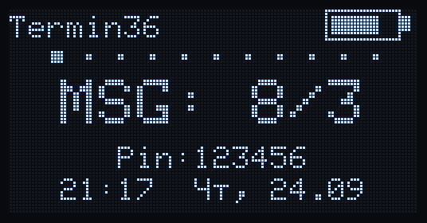
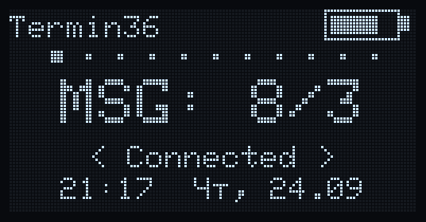

### Крупные часы на электронных чернилах

Через минуту простоя на главной MeshPocket и похожие панели показывают время на весь экран. Страницы соседей, шума, поиска частоты и маяка при этом не перекрываются.

Новое сообщение часы не закрывает: внизу пишется, сколько непрочитанных групп и чатов. Телефон, который забирает очередь, с часов не уводит, но забранную копию стирает и с экрана. Кнопка открывает сообщение, а если непрочитанных нет — возвращает на главную. Перед часами панель полностью очищается, чтобы не остался шлейф.

На OLED высотой 64 точки вместе с датой строка PIN становится мельче, а адрес Wi‑Fi на этой странице прячется.

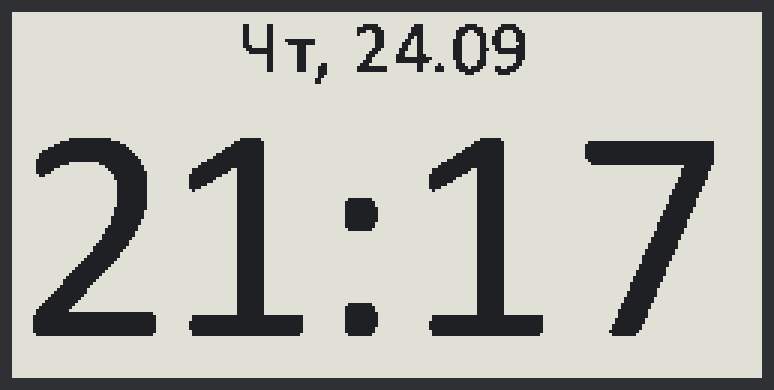
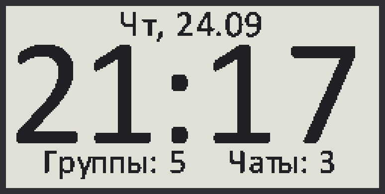

Все варианты: [дата и часы](docs/screens/gallery_date.png).

### Откуда берётся время

Часовой пояс задаётся командой `set tz +3`. Само время:

- консоль Companion: `set time 2026-09-24 21:17` или `clock sync`;
- первый фикс GPS, и только пока часы пустые;
- узел из списка `clock.node`.

В списке до 16 узлов, опрос по кругу. Нет маршрута — следующий. Первый раз через 20 секунд, затем каждые 2 минуты, пока времени нет, и раз в 6 часов, когда оно уже есть. К ответу прибавляется половина времени в пути. Уже идущие часы сдвигаются только вперёд и только если чужие впереди больше чем на 30 секунд. Шаг назад повторно использовал бы старые метки пакетов.

Список узлов времени сохраняется и после перезагрузки читается обратно. `clock.node` снова показывает имена, если эти узлы ещё есть среди контактов или соседей. Если узла в списке уже нет, на его месте будет `?`, а ключ останется.

Узел с выставленным временем сам отвечает на запрос. Это Companion и Repeater. Пустые часы в ответ не отдаются. Companion отвечает не чаще раза в 5 секунд. Комнатный сервер время не раздаёт и сам его не спрашивает.

Запрос идёт по известному пути, в том числе через репитеры, и не рассылается флудом. Если путь ещё не известен, спрашивается только узел, которого только что слышали напрямую.

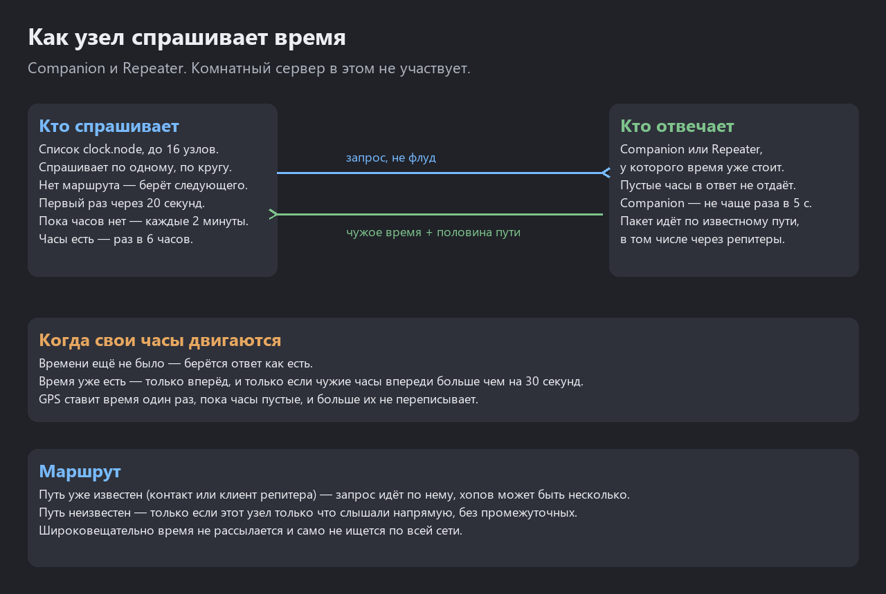

Схемы: один источник на всех, репитер как часы района, цепочка от этого узла. Уже идущие часы назад не ходят, поэтому более медленный сосед их не перетягивает. Круг без единого выставленного времени не заводится.

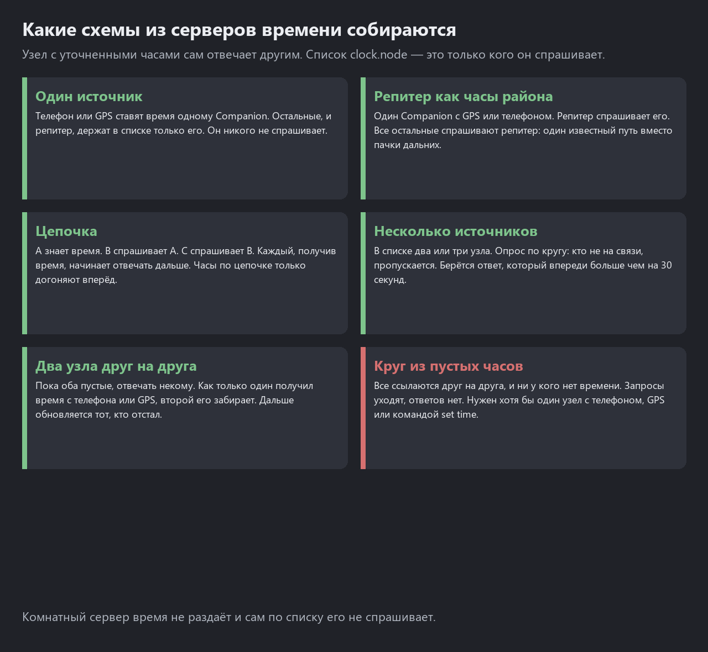

### Объявление со страницы недавних

Отдельная страница с иконкой advert убрана и с обычного экрана, и с маленького. Долгое нажатие на списке недавних узлов отправляет объявление. Пустой список пишет `no adverts`, в свободной нижней строке — подсказка жеста.

### Репитер выключается от севшей батареи

Ниже порога на экране `Low Battery. Shutting Down!`, затем питание снимается. Замер ниже 0,5 В не считается севшей батареей: это питание от сети или пустой АЦП. Иконка заряда на репитере, как и на Companion, больше не прыгает между соседними делениями.

### Тёмные цветные экраны

На T096, Tracker, T-Deck и других цветных TFT фон тёмный, шапка синяя, текст белый. Кириллица читается тем же шрифтом, что на OLED. На T096 текст чуть крупнее и садится в высоту строки. Heltec T114 по-прежнему чёрно-белый: цвет туда не попадает, русские буквы на месте.

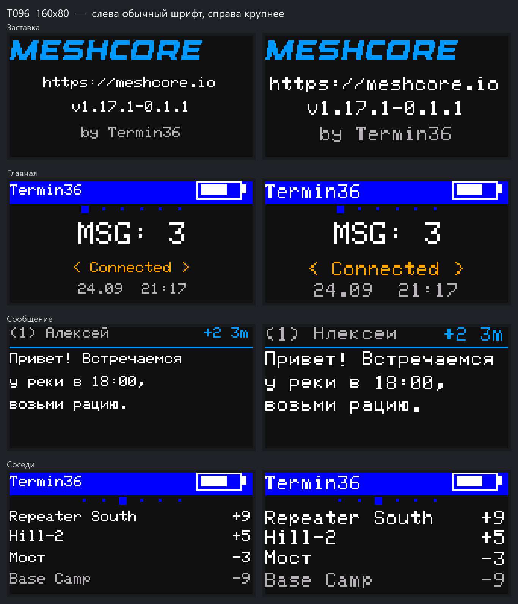

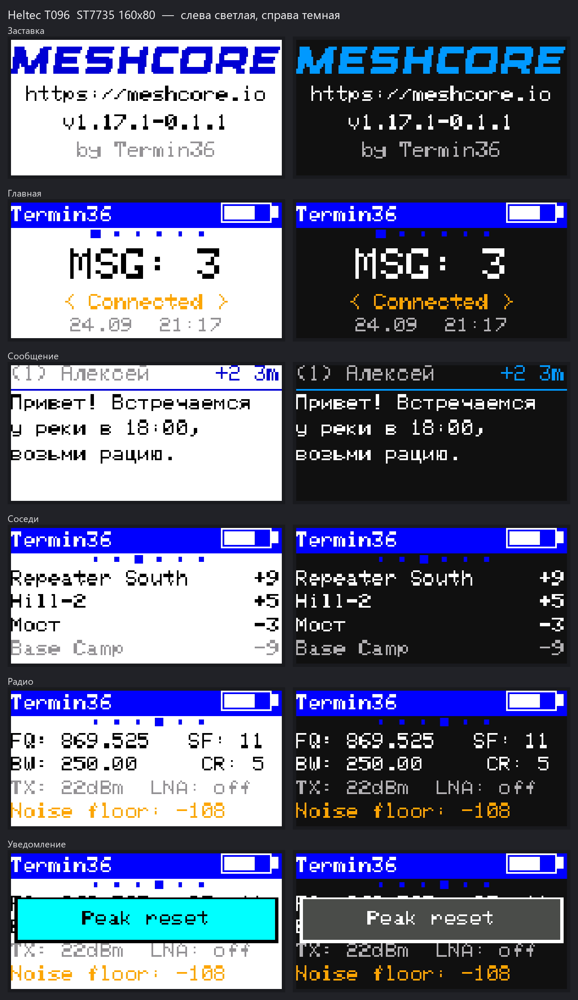

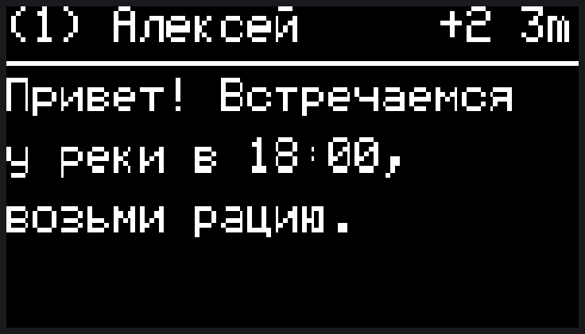

Остальные кадры: [галерея TFT](docs/screens/tft/gallery_before_after.png).

Иконка батареи больше не дёргается на каждом замере: уровень держится, пока напряжение заметно не сдвинется.

---

## v1.17.1-0.1.1

**Дата:** 23 сентября 2026  
**Скачать:** [релиз на GitHub](https://github.com/TERMIN36/MeshCore/releases/tag/v1.17.1-0.1.1)

На заставке теперь составной номер: сначала версия оригинального MeshCore, затем версия этой прошивки.

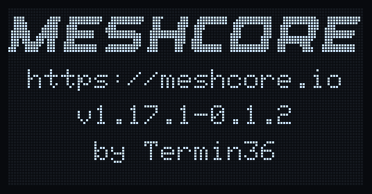

### Длинные сообщения листаются

Текст, который не помещается на экран, больше не обрезается снизу. Сообщение разбивается на страницы. В шапке видно `p1+`, `p2` и так далее.

- OLED: следующая страница сама через 4 секунды.
- Электронные чернила: через 10 секунд (полный кадр там дороже).
- Двойное нажатие листает сразу, прокрутка вверх возвращает к началу.

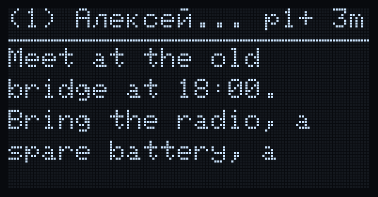
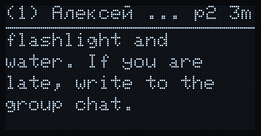

### Эмодзи не рисуются квадратами

Символы, для которых нет буквы на экране (эмодзи и часть кириллицы кроме русского алфавита), заменяются пробелом. Раньше на их месте были квадраты.

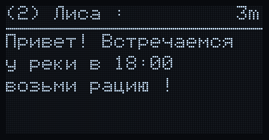

### Heltec MeshPocket и другие экраны 2.13"

На электронных чернилах 250×122 интерфейс занимает всю панель, как на OLED: строки не наезжают друг на друга, низ экрана не пустует. Русские буквы по высоте и жирности совпадают с латинскими.

Поиск шума и частот на таких экранах больше не «замирает», картинка периодически полностью очищается, чтобы не оставался шлейф от частичных обновлений.

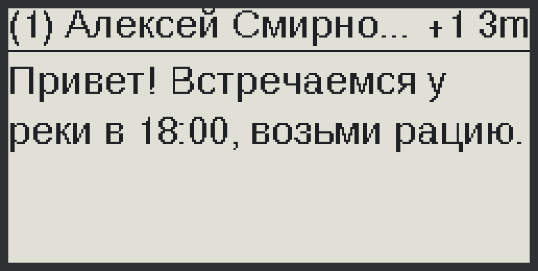
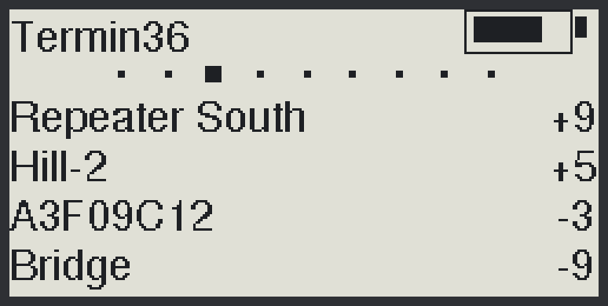
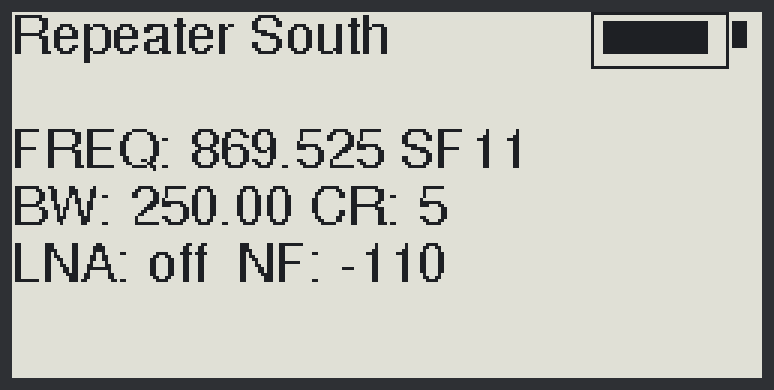

Все экраны этой версии:

На MeshPocket нет GPS, поэтому страниц координат и маяка там нет.

---

## v0.1.0

**Дата:** 23 сентября 2026  
**Скачать:** [релиз на GitHub](https://github.com/TERMIN36/MeshCore/releases/tag/v0.1.0)

Первая прошивка этой линейки. Устройство работает в одной сети с обычным MeshCore, но экраном и кнопкой можно пользоваться без телефона.

### Русский текст на экране

Имена, каналы и сообщения на кириллице читаются. Длинные строки переносятся по словам, слишком длинное имя обрезается многоточием, а не «ломается» посередине буквы.

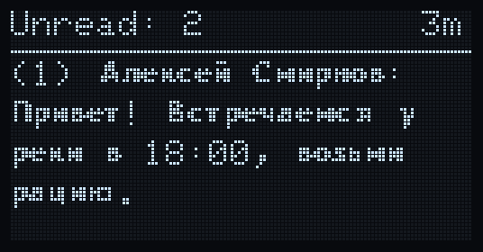

### Новые страницы Companion

Главный экран листается кнопкой. При переходе коротко показывается название страницы. Долгое нажатие — действие страницы.

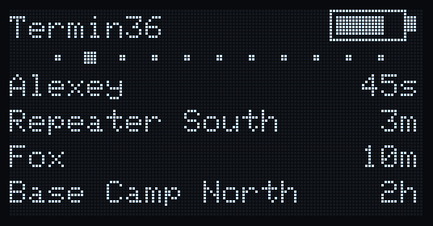

**Neighbors.** Кто из репитеров слышен напрямую и с каким качеством связи (SNR). Долгое нажатие запускает опрос. Если никого нет — подсказка, что нужно опросить.

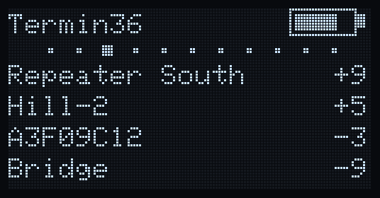
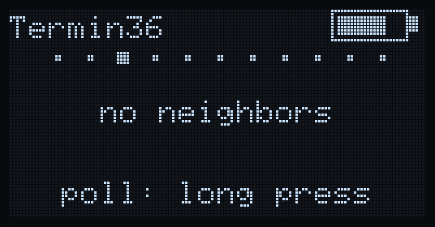

**Radio.** Частота, параметры радио, мощность, усилитель приёма (LNA) и уровень шума. Долгое нажатие включает и выключает LNA, если он есть на плате.

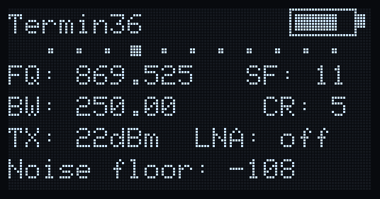

**Power.** Готовые профили батареи от самого экономного `Eco max` до самого чувствительного `Eco min`. Если Bluetooth не даёт процессору заснуть, на экране появляется подсказка.

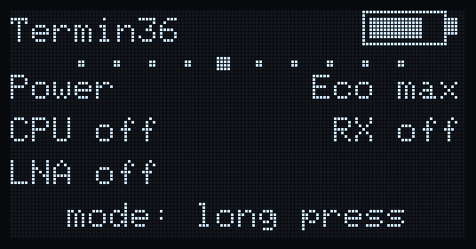
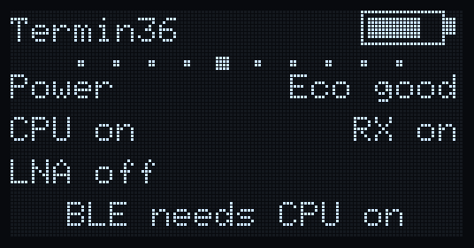

**Noise scan.** Текущий и пиковый шум крупными цифрами. Чем ближе к −120, тем тише эфир. Экран на этой странице не гаснет. Долгое нажатие сбрасывает пик.

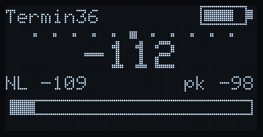

**Freq scan.** Поиск более тихих частот рядом с текущей. Долгое нажатие запускает поиск. Прошивка частоту сама не меняет — только показывает три самые тихие. Текущая помечена `*`.

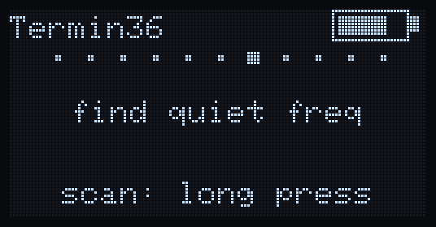
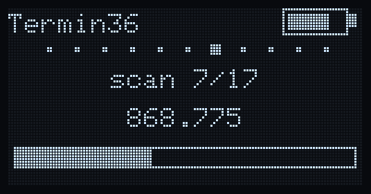
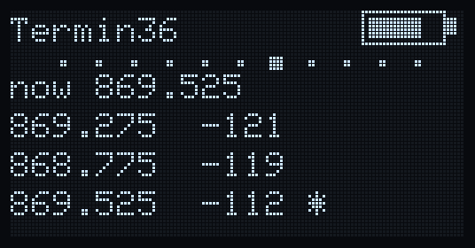

**GPS.** Модуль, фикс, спутники, координаты и высота. Долгое нажатие включает и выключает GPS.

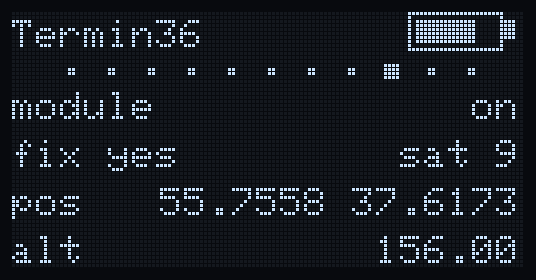

**Beacon.** Автономная отправка координат без телефона: соседям, в сеть, в канал или в личный чат. Три нажатия меняют интервал, четыре — выключают маяк. Страница есть, только если GPS найден и включён.

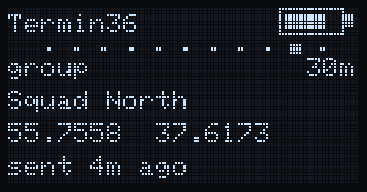
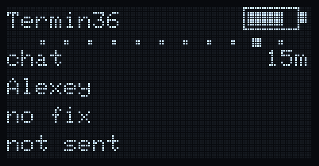
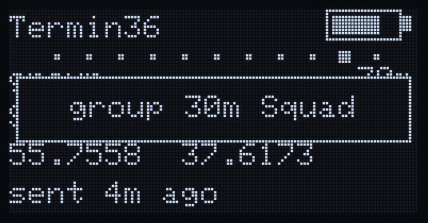

### Усилитель приёма выключен по умолчанию

На платах с внешним LNA (Heltec V4 и похожие) усилитель в городе часто поднимает шум. В этой прошивке он по умолчанию выключен. В тихом месте его можно включить на странице Radio, профилем питания или тройным нажатием на Repeater.

### Repeater на экране

На заставке и на главном экране репитера видны заряд, LNA и уровень шума.

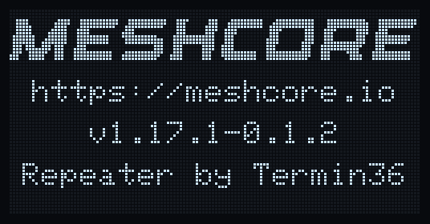
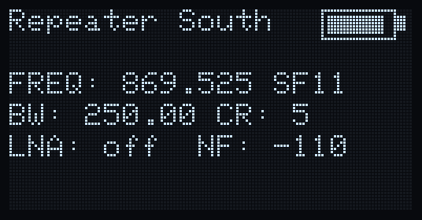
