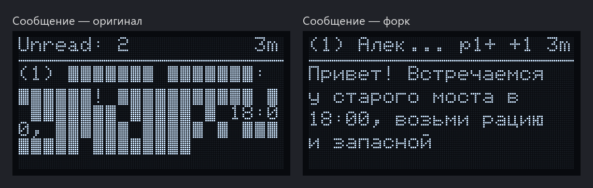
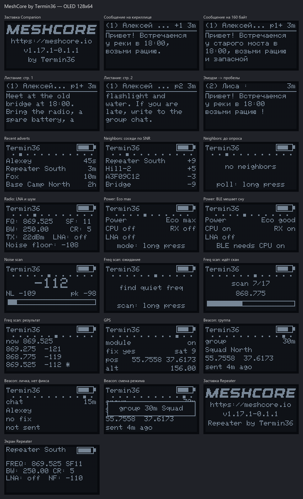
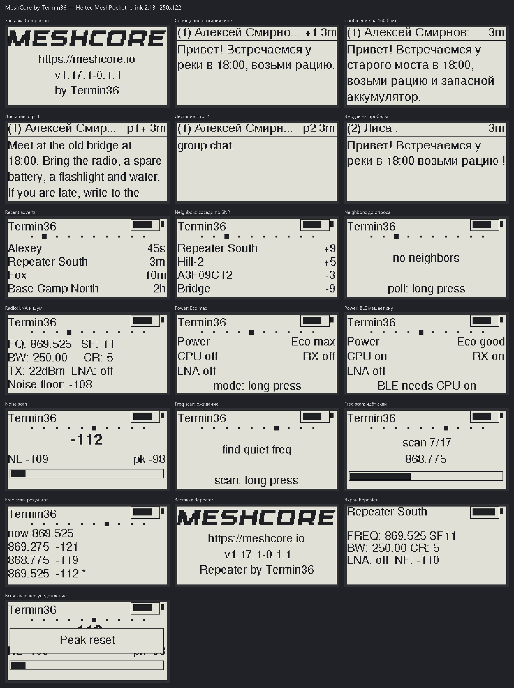

# MeshCore — форк by Termin36

Это форк проекта [MeshCore](https://github.com/meshcore-dev/MeshCore) — лёгкой C++ библиотеки и набора прошивок для многоскачковой (multi-hop) маршрутизации пакетов по LoRa. Форк полностью совместим с оригинальной сетью MeshCore по радиопротоколу и с официальными клиентами (мобильное приложение, веб-клиент, `meshcore-cli`), а все доработки касаются работы **самого устройства**: экрана, кнопки, диагностики эфира, энергопотребления и автономных функций, которые доступны без телефона.

## О чём проект

MeshCore позволяет строить децентрализованные радиосети без интернета и без центрального сервера. Узлы бывают нескольких типов:

- **Companion** — «личная рация», подключается к телефону или компьютеру по BLE, USB или Wi-Fi и не ретранслирует чужие пакеты.
- **Repeater** — ретранслятор, который расширяет покрытие сети.
- **Room Server** — простая доска объявлений (BBS).
- **Sensor**, **KISS Modem**, **Terminal Chat** — узлы для телеметрии, внешних программ и консольного чата.

Подробнее об оригинальном проекте: [документация](https://docs.meshcore.io), [FAQ](./docs/faq.md), [Discord](https://meshcore.gg).

## Мотивация

Оригинальная прошивка рассчитана на то, что основное взаимодействие идёт через приложение на телефоне, а экран на устройстве носит вспомогательный характер. На практике (выезды, поиск места под репитер, работа без телефона) этого не хватает:

1. **Русский текст на экране превращается в квадраты.** Имена контактов, каналов и сообщения на кириллице было невозможно прочитать на самом устройстве.
2. **Нет инструментов диагностики эфира.** Чтобы понять, слышит ли узел ближайшие репитеры, насколько зашумлена частота и есть ли рядом частота потише, нужен был отдельный SDR или телефон.
3. **Встроенный LNA на Heltec V4.3 мешает приёму.** Внешний малошумящий усилитель (FEM LNA) был включён по умолчанию, и в городском эфире он часто перегружает приёмник: растёт уровень шума, а реальная чувствительность падает.
4. **Нет управления энергопотреблением с устройства.** Режимы усиления приёма и сон процессора нельзя было переключить без приложения.
5. **Нет автономной передачи координат.** Чтобы отправлять свою позицию (например, при передвижении группы), нужен был телефон.

Форк решает эти задачи так, чтобы всё управлялось **одной кнопкой** прямо на устройстве, а настройки сохранялись в энергонезависимой памяти.

## Как это выглядит

Картинки сгенерированы скриптом `tools/screen_render/render_oled.py`: он берёт шрифты и иконки прямо из исходников прошивки и библиотеки Adafruit GFX, повторяет логику драйверов дисплеев и разметку страниц, поэтому совпадает с устройством пиксель в пиксель. Данные на экранах (имена, частоты, координаты) — примерные.

### OLED 128×64 (Heltec V4 и аналоги)

Кириллица — было и стало:



Все новые и изменённые экраны:



Отдельные экраны лежат в [`docs/screens/oled`](docs/screens/oled).

### Heltec MeshPocket (E-Ink 2.13", 250×122)

Тот же интерфейс на E-Ink: латиница — шрифтом FreeSans, кириллица — подобранным под него растровым шрифтом. В сборке MeshPocket нет GPS, поэтому страниц GPS и Beacon нет.



Отдельные экраны лежат в [`docs/screens/meshpocket`](docs/screens/meshpocket).

## Что изменено в форке

### 1. Кириллица на всех типах дисплеев

- Добавлен собственный пропорциональный растровый шрифт для букв А–Я, а–я, Ё, ё (`src/helpers/ui/CyrillicFont.h`, `src/helpers/ui/CyrillicGlyphs.inc`):
  - для OLED SSD1306 128×64 — Tahoma Bold высотой 10 px, подобран под строку интерфейса 11 px;
  - для TFT ST7789 — два размера в стиле ArialMT;
  - для E-Ink (GxEPD) — два размера, сгенерированные из Liberation Sans под высоту заглавных и строчных FreeSans 9pt и FreeSansBold 12pt, чтобы русские буквы не отличались от латинских по весу и высоте (`tools/cyr_font/gen_eink_cyr.py`).
- Драйверы `SSD1306Display`, `ST7789Display` и `GxEPDDisplay` научились:
  - декодировать UTF-8 и рисовать кириллицу вперемешку с латиницей;
  - правильно считать ширину строки с кириллицей (нужно для выравнивания и обрезки);
  - переносить длинные сообщения по словам (`printWordWrap`) с учётом кириллицы.
- Остальные драйверы получили то же самое через общий помощник `src/helpers/ui/CyrillicText.h`. Он рисует кириллицу OLED-шрифтом, масштабированным под размер латиницы конкретного экрана:
  - `SH1106Display` — OLED 1.3" (T-Beam Supreme, Station G2/G3, Nano G2 Ultra, ThinkNode M2, Wio Tracker L1);
  - `ST7789LCDDisplay` — TFT Heltec V4 / V4 R8 и LilyGo T-Deck;
  - `ST7735Display` — Heltec Tracker, Tracker V2, T096, T1;
  - `E213Display` и `E290Display` — E-Ink Heltec Wireless Paper, Vision Master E213 и E290;
  - `NV3001BDisplay` — Heltec RC32;
  - `LGFXDisplay` — SenseCAP Indicator.
- `U8g2Display` (LilyGo T-Echo Card) использует встроенные кириллические шрифты U8g2 (`5x7_t_cyrillic`, `6x10_t_cyrillic`).
- `translateUTF8ToBlocks` сохраняет кириллицу; символы без глифа (эмодзи, украинские буквы и т. п.) заменяются пробелом, подряд идущие пробелы схлопываются в один.
- Обрезка строки с многоточием (`drawTextEllipsized`) больше не разрезает многобайтовый UTF-8 символ посередине.
- Имя отправителя в окне сообщения тоже обрезается многоточием и не вылезает за край экрана.
- Длинное сообщение больше не обрезается снизу: `printWordWrap` возвращает хвост текста, который не влез, и окно сообщения листает его страницами. На OLED страница меняется каждые 4 секунды, на E-Ink — каждые 10 (полный refresh дорогой). В шапке появляется метка `p2+`. Двойное нажатие листает страницу сразу, вверх возвращает к началу.
- E-Ink 2.13" (Heltec MeshPocket, Wio Tracker L1 E-Ink): интерфейс раскладывается на логическую сетку 128×64 на всю панель 250×122 (`EINK_LOGICAL_HEIGHT`), как на OLED. Раньше сетка была 128×128 и строки списков налезали друг на друга, а нижняя часть панели пустовала. Крупный текст (размер 2) больше не заходит на индикатор страниц; курсор ставится по базовой линии FreeSans, чтобы латиница и кириллица сидели на одной высоте; ширина строк с кириллицей учитывает пробелы.
- Частичные обновления E-Ink оставляют шлейф, поэтому каждые 20 кадров экран полностью заливается белым (`cleanScreen`), то же делается при включении, чтобы стереть картинку с прошлого включения.

### 2. Новые страницы на главном экране Companion

Главный экран листается кнопкой; к оригинальным страницам добавлены новые. При переходе на страницу коротко показывается её название.

| Страница | Что показывает | Действие по Enter (долгое нажатие) |
|---|---|---|
| **Neighbors** | Ближайшие репитеры, которые слышат узел напрямую (zero-hop), отсортированы по SNR | Отправить опрос соседей |
| **Radio** | Частота, SF, BW, CR, мощность TX, состояние LNA, уровень шума | Включить/выключить FEM LNA |
| **Power** | Текущий профиль энергосбережения и его составляющие | Переключить профиль |
| **Noise scan** | Текущий RSSI крупными цифрами, уровень шума, пиковое значение и шкалу | Сбросить пик |
| **Freq scan** | Результат поиска самой тихой частоты | Запустить сканирование |
| **GPS** | Состояние модуля, фикс, спутники, координаты, высота | Включить/выключить GPS |
| **Beacon** | Режим маяка, адресат, координаты, время последней отправки | Выбрать следующий режим маяка |

Подробности по каждой странице:

- **Neighbors.** Узел отправляет zero-hop запрос обнаружения (`NODE_DISCOVER_REQ`) только для репитеров и в течение 60 секунд собирает ответы. В таблице хранится до 8 соседей: имя берётся из контактов, а если репитер неизвестен, показываются первые 4 байта его ключа. Если соседей больше, чем помещается на экране, список автоматически прокручивается каждые 2 секунды.
- **Noise scan.** RSSI замеряется каждые 50 мс независимо от отрисовки, чтобы на медленном E-Ink пик не пропускал всплески. OLED перерисовывается каждые 200 мс, E-Ink — каждые 3 с (каждый кадр блокирует цикл). Экран не гаснет, пока открыта страница. Пик не обновляется во время приёма пакета (метка `PKT`), поэтому он отражает именно шум, а не чужие передачи.
- **Freq scan.** Сканирование идёт от текущей частоты в обе стороны с шагом, равным ширине полосы (BW), в пределах разрешённого диапазона: 863–870 МГц для EU868 и 902–928 МГц для US915. Проверяется до 17 точек, в каждой усредняется 8 замеров RSSI; сами замеры выполняются в фоне, а не внутри отрисовки кадра. На экран выводятся три самые тихие частоты, текущая помечена `*`. На E-Ink полоса прогресса не рисуется (каждый кадр слишком дорогой), по окончании экран обновляется сам. На время сканирования калибровка шумового порога приостанавливается, а после него радио полностью возвращается к сохранённым настройкам. Если уйти со страницы, сканирование останавливается, и выводится результат по уже проверенным точкам. **Прошивка сама частоту не меняет**, она только подсказывает.
- **GPS.** Показывается, питается ли модуль после программного выключения («stays powered» — если у платы нет пина питания GPS, и чип продолжает потреблять ток).
- **Beacon.** Страница видна только когда GPS-модуль обнаружен и включён.

### 3. GPS-маяк (автономная отправка координат)

Доступен в сборках с `ENV_INCLUDE_GPS=1`. Нажатие Enter на странице **Beacon** перебирает режимы по кругу:

| Режим | Что отправляется | Интервал |
|---|---|---|
| `off` | Ничего | — |
| `advert neighbors` | Advert с координатами только ближайшим соседям (zero-hop) | 10 минут |
| `advert flood` | Advert с координатами по всей сети (flood в пределах scope по умолчанию) | 30 минут |
| `group <канал>` | Текстовое сообщение `gps <широта> <долгота>` в групповой канал; перебираются все настроенные каналы | 5–120 минут, по умолчанию 30 |
| `chat <контакт>` | Такое же сообщение в личку; в списке 8 контактов, от которых adverts приходили последними | 5–120 минут, по умолчанию 30 |

Как это работает:

- При включении маяка GPS включается автоматически. Первая отправка происходит через 20 секунд.
- Если фикса нет, отправка откладывается и повторяется каждые 15 секунд, пока координаты не появятся.
- В режиме `chat` маяк ждёт, пока предыдущее личное сообщение будет подтверждено (ACK), и не создаёт очередь.
- При неудачной отправке маяк повторяет попытку через 20 секунд.
- **Тройное нажатие** на странице Beacon меняет интервал для режимов `group` и `chat`: 5 → 10 → 15 → 30 → 60 → 120 минут.
- **Четверное нажатие** на странице Beacon выключает маяк.
- Режим, канал, контакт и интервалы сохраняются и восстанавливаются после перезагрузки.

### 4. Профили энергосбережения и сон процессора (ESP32)

На странице **Power** одним нажатием перебираются готовые профили — от самого экономного `Eco max` до самого чувствительного `Eco min`. Профиль складывается из трёх параметров:

- **CPU off/on** — лёгкий сон процессора ESP32 во время простоя;
- **RX on/off** — режим повышенного усиления приёма SX126x (RX boosted gain);
- **LNA on/off** — внешний малошумящий усилитель (только на платах с управляемым FEM).

Недоступные на конкретной плате параметры автоматически исключаются из списка, поэтому `Eco max` — это всегда самый экономный режим именно для этой платы. Если параметры выставлены вручную и не совпадают ни с одним профилем, отображается `Custom`.

Сон процессора (новый `idleSleep()` в `ESP32Board`):

- включается, только когда у узла нет незавершённой работы, **экран погашен**, **GPS выключен** и **Bluetooth выключен**;
- процессор просыпается сразу при приходе LoRa-пакета (DIO1), при нажатии кнопки пользователя или по таймеру раз в секунду;
- требование выключенного Bluetooth связано с тем, что `esp_light_sleep_start()` останавливает контроллер Bluedroid, а в используемом Arduino core нет modem sleep для BT, поэтому любой сон разрывает связь с телефоном. Если GPS или BLE мешают сну, на экране появится подсказка «GPS needs CPU on» / «BLE needs CPU on»;
- на nRF52 отдельный выбор не нужен и не показывается: там процессор и так спит в простое.

### 5. FEM LNA: управление и новое значение по умолчанию

- Для Companion и Repeater внешний LNA теперь **по умолчанию выключен** (режим bypass). Это сделано под Heltec V4.3, где включённый LNA в плотном эфире ухудшает приём.
- Состояние LNA (`fem_rxgain`) теперь сохраняется в настройках Companion (раньше этот ключ не загружался и не записывался).
- Переключить LNA можно на странице **Radio** (Companion), профилем на странице **Power** или тройным нажатием на Repeater.
- Управление работает на платах с управляемым FEM: Heltec V4, Heltec T096, Heltec Tracker V2, Station G3.

### 6. Стабильность приёма Companion

- Для Companion включён периодический сброс AGC радиомодуля каждые 4 секунды (в оригинале у Companion его не было). SX1262 иногда «залипает» в неудачном состоянии усиления, и узел перестаёт слышать слабые пакеты — сброс AGC это лечит.
- В `RadioLibWrapper` добавлены `setFrequency()` для быстрой смены частоты без полной переинициализации и `pauseNoiseFloor()` для приостановки калибровки шумового порога (используются в Freq scan).

### 7. Доработки экрана Repeater

- Индикатор заряда батареи в правом верхнем углу.
- Новая строка `LNA: on/off  NF: <уровень шума>`.
- **Тройное нажатие** включает и выключает FEM LNA, состояние сохраняется.
- На заставке вместо `< Repeater >` выводится `Repeater by Termin36`.

### 8. Кнопка: четверное нажатие

- `MomentaryButton` теперь различает 4 и более нажатий подряд (`BUTTON_EVENT_QUAD_CLICK`), раньше они считались тройным нажатием.
- Добавлен код клавиши `KEY_QUAD`.
- Тройное и четверное нажатия на главном экране передаются текущей странице. На остальных экранах тройное нажатие, как и раньше, переключает звук (buzzer).

### 9. Прочее

- На заставке Companion вместо даты сборки выводится `by Termin36` и составная версия без хеша коммита, например `v1.17.1-0.1.1` (`src/helpers/FirmwareVersion.h`).
- В `BaseChatMesh` добавлен `isTextAckPending()`, чтобы узнать, ожидается ли ACK на отправленное личное сообщение.
- В `MainBoard` добавлены виртуальные методы `canSelectMcuSleep()` и `idleSleep()`; прежний `ESP32Board::sleep()` теперь реализован через `idleSleep()`.

## Управление одной кнопкой (Companion)

| Действие | Результат |
|---|---|
| Одиночное нажатие | Следующая страница (или включить экран); в окне сообщения — следующее непрочитанное |
| Двойное нажатие | Предыдущая страница; в окне длинного сообщения — следующая страница текста |
| Долгое нажатие | Действие текущей страницы (Enter) |
| Тройное нажатие | На странице Beacon — интервал маяка; в остальных местах — вкл/выкл звук |
| Четверное нажатие | На странице Beacon — выключить маяк |

На устройствах с джойстиком или энкодером «Enter» — это нажатие центральной кнопки.

## Краткая инструкция

### Шаг 1. Получите файл прошивки

Прошивки форка нет в каталоге веб-прошивальщиков. Готовые файлы лежат на странице [Releases](https://github.com/TERMIN36/MeshCore/releases/latest): найдите файл со своей платой и типом прошивки в имени, например `heltec_v4_companion_radio_ble-v1.17.1-0.1.1-abc1234-merged.bin`.

Релизы собираются только для плат с дисплеем (в сборке задан `DISPLAY_CLASS`), потому что все доработки касаются экрана устройства: Heltec V2/V3/V4, T114, Wireless Paper, RAK, T-Beam, T-Deck и др. Платы без экрана (например, Heltec WSL3) пропускаются; собрать всё можно с `DISPLAY_ENVS_ONLY=0 sh build.sh ...`.

Если нужной сборки в релизе нет, соберите файл самостоятельно:

1. Установите [Visual Studio Code](https://code.visualstudio.com) и расширение [PlatformIO](https://docs.platformio.org) (или только `pip install platformio`).
2. Склонируйте этот репозиторий.
3. Выберите окружение (environment) под свою плату в `variants/<плата>/platformio.ini`. Например, для Heltec V4:
   - `heltec_v4_companion_radio_ble` — Companion с Bluetooth;
   - `heltec_v4_companion_radio_usb` — Companion по USB;
   - `heltec_v4_companion_radio_wifi` — Companion по Wi-Fi;
   - `heltec_v4_repeater` — репитер;
   - варианты с `_tft_` — для версии с цветным экраном.
4. Соберите прошивку:

```bash
pio run -e heltec_v4_companion_radio_ble
```

Готовые файлы появятся в папке `.pio/build/<окружение>/`:

| Файл | Когда использовать |
|---|---|
| `firmware-merged.bin` | ESP32, **первая установка** или переход с другой прошивки. Содержит загрузчик и таблицу разделов, flash стирается полностью |
| `firmware.bin` | ESP32, **обновление** поверх уже установленной прошивки MeshCore. Настройки, контакты и ключи сохраняются |
| `firmware.zip` | nRF52 (RAK, T114, T-Echo и т. п.), прошивается через DFU |

### Шаг 2. Прошейте через веб-прошивальщик

Прошивать удобнее всего через [веб-прошивальщик Мешкартеля](https://meshcoretel.ru/ru/flasher). Он работает прямо в браузере через Web Serial, поэтому нужен **Chrome или Edge на компьютере** (Firefox, Safari и мобильные браузеры не подходят).

1. Подключите устройство к компьютеру USB-кабелем с передачей данных (не только зарядным).
2. Откройте [meshcoretel.ru/ru/flasher](https://meshcoretel.ru/ru/flasher).
3. В блоке **«Кастомная прошивка»** нажмите **«Выберите файл»** и укажите файл из шага 1. Официальные прошивки из списка устройств выбирать не нужно — это прошивки upstream без доработок форка.
4. Проверьте чекбокс **«Очистить устройство»**:
   - для `firmware-merged.bin` он включится сам, после предупреждения о том, что flash и идентичность устройства будут стёрты. Это нормально для первой установки;
   - для `firmware.bin` чекбокс должен быть **выключен**. Если его включить, прошивальщик запишет файл с нулевого адреса вместо адреса приложения, и устройство не загрузится. Тогда придётся прошить `firmware-merged.bin`.
5. Нажмите **«Прошить»**, выберите COM-порт устройства в окне браузера и дождитесь сообщения **«Прошивка завершена»**. Не отключайте устройство во время прошивки.
6. Для nRF52 выберите `.zip`. Если устройство не отвечает, сначала переведите его в DFU кнопкой **«Войти в DFU»** (или двойным нажатием кнопки Reset на плате) и повторите прошивку.

Если порт не появляется в списке, зажмите кнопку **BOOT** (на Heltec V4 — кнопка `PRG`/`USER`), нажмите и отпустите **RST**, отпустите BOOT и повторите шаг 5.

После первой установки с очисткой узел получит новые ключи и пустой список контактов. При обновлении через `firmware.bin` всё сохраняется.

### Шаг 3. Настройте узел

- **Companion.** Подключитесь официальным клиентом: [веб](https://app.meshcore.nz), [Android](https://play.google.com/store/apps/details?id=com.liamcottle.meshcore.android), [iOS](https://apps.apple.com/us/app/meshcore/id6742354151?platform=iphone), [Python CLI](https://github.com/fdlamotte/meshcore-cli). PIN для Bluetooth показывается на экране устройства (по умолчанию `123456`).
- **Repeater / Room Server.** На той же странице прошивальщика есть кнопки **«Настройка Репитера»** и **«Консоль»** для настройки по USB. Также подходит [config.meshcore.io](https://config.meshcore.io).
- **Радиопараметры** должны совпадать с вашей локальной сетью. Актуальные значения для региона показаны на [главной странице Мешкартеля](https://meshcoretel.ru/ru). Например, для Москвы на момент написания: 868.731 МГц, полоса 62.5 кГц, SF 7, CR 7.

Разработчикам: прошить можно и напрямую из PlatformIO, без браузера — `pio run -e <окружение> -t upload`.

### Типовые сценарии

- **Проверить, слышит ли узел репитеры.** Откройте страницу **Neighbors**, сделайте долгое нажатие и подождите несколько секунд. Список покажет соседние репитеры и SNR до каждого из них.
- **Оценить шум в точке установки.** Откройте **Noise scan** и понаблюдайте за RSSI и пиком. Чем ниже значения (ближе к −120 dBm), тем тише эфир. Для сравнения попробуйте переключить LNA на странице **Radio**: если шум заметно растёт, а пакеты лучше не принимаются, LNA лучше оставить выключенным.
- **Найти частоту потише.** Откройте **Freq scan** и сделайте долгое нажатие. Если в топе окажется другая частота, её можно выставить через приложение — но учтите, что все узлы вашей сети должны работать на одной частоте.
- **Экономить батарею.** На странице **Power** выберите `Eco max`. Чтобы процессор мог засыпать, выключите Bluetooth и GPS (или используйте USB/Wi-Fi сборку) и дайте экрану погаснуть.
- **Передавать свою позицию без телефона.** Включите GPS на странице **GPS**, перейдите на **Beacon** и долгими нажатиями выберите режим и адресата. Тройным нажатием настройте интервал, четверным — выключите маяк.

### Обновление рендеров экранов

Если вы поменяли разметку страниц, картинки можно пересобрать без устройства (нужны Python 3 и Pillow, а также хотя бы одна сборка с дисплеем, чтобы PlatformIO скачал Adafruit GFX со шрифтами):

```bash
pip install pillow
python tools/screen_render/render_oled.py
```

Скрипт сохраняет PNG в `docs/screens/`: OLED — в `oled/` и `gallery.png`, MeshPocket — в `meshpocket/` и `gallery_meshpocket.png`. Масштаб и смещения E-Ink он читает из `variants/mesh_pocket/platformio.ini`. Разметка страниц в скрипте повторяет `UITask.cpp` вручную, поэтому при изменении UI нужно обновить и соответствующую функцию `scr_*` в скрипте.

Кириллицу для E-Ink пересобирает `python tools/cyr_font/gen_eink_cyr.py` (нужен Liberation Sans или Arial; если установлен FreeSans из GNU FreeFont, берётся он).

### Новые ключи настроек Companion

Эти настройки сохраняются в файл настроек узла вместе с остальными:

| Ключ | Значение |
|---|---|
| `fem_rxgain` | FEM LNA: 0 — выкл (по умолчанию), 1 — вкл |
| `mcu_slp` | Сон процессора ESP32 в простое: 0/1 |
| `bcn` | Режим маяка: 0 — off, 1 — advert neighbors, 2 — advert flood, 3 — group, 4 — chat |
| `bcn_ch` | Индекс группового канала для маяка |
| `bcn_gm` / `bcn_cm` | Интервал маяка в минутах для group / chat (5–180) |
| `bcn_pub` | Публичный ключ контакта для режима chat |

## Совместимость с платами

Форк разрабатывается и проверяется на Heltec V4, но доработки не привязаны к одной плате. На других устройствах с экраном часть функций зависит от железа:

| Возможность | Где работает |
|---|---|
| Новые страницы Companion (Neighbors, Power, Noise/Freq scan, Beacon) | Все сборки Companion с интерфейсом `ui-new` и экраном |
| Кириллица на экране | Все драйверы дисплеев: SSD1306, SH1106, ST7789, ST7735, NV3001B, GxEPD, E213, E290, LovyanGFX и U8g2 |
| Управление LNA | Только платы с управляемым FEM: Heltec V4, T096, Tracker V2, Station G3. На остальных показывается `LNA: n/a` |
| Сон процессора | Только ESP32 (V2, V3, V4, T-Beam и т. п.) |
| GPS-маяк | Сборки с `ENV_INCLUDE_GPS=1`, страница появляется только при обнаруженном и включённом GPS |
| RX boost в профилях Power | Радиомодули SX1262/SX1268/LLCC68/LR11xx. На SX1276 (Heltec V2, T-Beam SX1276) режим не поддерживается |

## Ограничения и известные особенности

- Шрифт поддерживает только русский алфавит (А–Я, а–я, Ё, ё). Украинские, белорусские и другие дополнительные кириллические буквы, а также эмодзи заменяются пробелом.
- На экранах, где кириллица рисуется через `CyrillicText.h`, русские буквы немного выше латинских: OLED-шрифт высотой 10 px стоит рядом со стандартным шрифтом 6×8 и масштабируется вместе с ним.
- Сон процессора работает только на ESP32 и только при выключенных Bluetooth, GPS и экране. В BLE-сборке сон возможен только после отключения Bluetooth на устройстве.
- Во время Freq scan узел не принимает пакеты на рабочей частоте — сканирование занимает несколько секунд.
- Маяк в режимах `group` и `chat` отправляет обычные текстовые сообщения — их увидят все участники канала или адресат.
- Значение LNA по умолчанию изменено, поэтому после прошивки на платах с FEM приём может отличаться от оригинальной прошивки. Если в вашей местности эфир тихий, попробуйте включить LNA.

## Изменённые файлы

- `examples/companion_radio/` — страницы UI, маяк, опрос соседей, профили питания, сон процессора, новые настройки.
- `examples/simple_repeater/` — батарея, LNA и уровень шума на экране, LNA по умолчанию выключен.
- `src/helpers/ui/` — кириллический шрифт, UTF-8 в драйверах дисплеев, постраничный вывод длинных сообщений, четверное нажатие.
- `src/helpers/FirmwareVersion.h` — составная версия upstream + форк.
- `src/helpers/ESP32Board.h`, `src/MeshCore.h` — лёгкий сон с пробуждением от кнопки.
- `src/helpers/radiolib/` — смена частоты и пауза калибровки шума.
- `src/helpers/BaseChatMesh.h` — проверка ожидания ACK.
- `variants/heltec_v4/LoRaFEMControl.cpp` — комментарий к логике управления LNA.
- `variants/mesh_pocket/`, `variants/wio-tracker-l1-eink/` — сетка 128×64 для E-Ink 2.13".
- `tools/screen_render/`, `docs/screens/` — генератор рендеров экранов (OLED и MeshPocket) и готовые картинки.
- `tools/cyr_font/` — генераторы кириллических шрифтов для OLED и E-Ink.

## Версии

Номер версии составной: сначала версия оригинального MeshCore, на которой основан форк, затем версия самого форка, например `v1.17.1-0.1.1`.

- **Первая часть** (`v1.17.1`) меняется только при переходе на новый релиз оригинала.
- **Вторая часть** (`0.1.1`) — версия форка по [semver](https://semver.org/lang/ru/). 

Обе части задаются в одном месте — [`src/helpers/FirmwareVersion.h`](src/helpers/FirmwareVersion.h) (`MESHCORE_BASE_VERSION` и `FORK_VERSION`). Заставка показывает версию без хеша, приложению по Bluetooth уходят первые 19 символов строки `v1.17.1-0.1.1-<хэш коммита>`. Узнать текущую версию: `bash build.sh get-version`.

## Выпуск релиза

Релизы собираются автоматически в GitHub Actions (`.github/workflows/release.yml`). Тег должен совпадать с версией из `FirmwareVersion.h` (допустимы суффиксы `-rc*`, `-beta*`, `-alpha*`):

```bash
git tag v1.17.1-0.1.1
git push origin v1.17.1-0.1.1
```

Дальше всё происходит само:

1. Собираются все прошивки Companion (BLE и USB), репитера и комнатного сервера для плат с экраном — около 200 сборок, это занимает примерно час.
2. Создаётся опубликованный релиз `MeshCore Termin36 v1.17.1-0.1.1` с файлами прошивок, инструкцией из `.github/release-notes.md` и списком изменений.
3. Если какая-то плата не собралась, релиз всё равно выходит, просто без её файлов. Упавшие сборки видны на вкладке Actions.

Пререлизом считается только тег с `-rc`, `-beta` или `-alpha` (например, `v1.17.1-0.1.1-rc1`): он не становится «последним» и не попадает по ссылке `releases/latest`. Обычный составной тег `v1.17.1-0.1.1` — полноценный релиз.

Проверить сборку без выпуска релиза можно кнопкой **Run workflow** у workflow **Release** на вкладке Actions.

## Синхронизация с оригиналом

Форк следит за веткой основного репозитория [meshcore-dev/MeshCore](https://github.com/meshcore-dev/MeshCore). Изменения сделаны так, чтобы не трогать радиопротокол и формат пакетов, поэтому устройства с этой прошивкой работают в одной сети с узлами на оригинальной прошивке.

## Лицензия

Как и оригинальный MeshCore, проект распространяется под лицензией MIT: его можно свободно использовать, изменять и распространять, в том числе в коммерческих целях.
