# MeshCore — прошивка для устройства

Форк [MeshCore](https://github.com/meshcore-dev/MeshCore) с тем же радиопротоколом: узел стоит в одной сети с обычными узлами и открывается официальными клиентами (приложение, веб, `meshcore-cli`). Роли те же: Companion, Repeater и комнатный сервер. Ниже — что в этой прошивке есть целиком.

**Экран и кнопка.** Кириллица на OLED, цветных TFT, чёрно-белом T114 и электронных чернилах. Длинный текст листается страницами, имя обрезается по границе буквы, эмодзи на экране становятся пробелом. Companion читает входящие без телефона: до 32 сообщений, очередь можно открыть снова. Одной кнопкой листаются страницы соседей, радио, питания, шума, поиска частоты, GPS и маяка. На списке недавних узлов долгое нажатие отправляет объявление. Контакт **Console** в чате выполняет команды платы и отвечает в том же диалоге.

**Радио.** Три профиля: Normal, Long (869.495 МГц, 62.5 кГц, SF11, CR 4/5) и HiNoise (та же частота, 31.25 кГц, SF10, CR 4/7). На Long и HiNoise компаньон включает ретрансляцию. LNA включается с кнопки; на Heltec V4 и похожих платах он по умолчанию выключен. Профили питания от Eco max до Eco min, на ESP32 процессор засыпает, когда экран погашен и Bluetooth с GPS не держат его включённым. Поиск частоты показывает более тихие каналы и сам рабочую частоту не меняет.

**Время и позиция.** Часы ставятся с телефона, с первого фикса GPS или запросом у узла из списка `clock.node`. Companion и репитер сами отвечают соседям, если время уже стоит. На главной — местное время и дата, день недели по-русски или по-английски. На электронных чернилах через минуту простоя открываются крупные часы, их можно выключить. Маяк шлёт координаты соседям, в сеть, в канал или в выбранный чат.

**Экраны.** На цветных TFT тёмный фон и белый текст. На электронных чернилах страница Setup выбирает, как панель стирает старые буквы: длинная волна, короткая или смешанный режим. Новое сообщение всегда рисуется длинной волной.

**Репитер.** На экране заряд, частота, шум, страница Radio с теми же профилями и страница Wi‑Fi с адресом. Ниже порога батареи репитер выключается. На LilyGO T-Beam 1W температура, влажность и давление BME280 уходят в телеметрию, если датчик есть. В объявлении можно передать тип антенны, высоту и направление. Прошивка обновляется по воздуху: ESP32 через точку `MeshCore-OTA`, nRF52 по Bluetooth.

**Веб-панель репитера.** На ESP32, по адресу со страницы Wi‑Fi, вход `admin`. Живой статус: узел, часы, радио, соседи, статистика, сеть. Там же правятся радио, имя и антенна, режим сна Wi‑Fi, NTP, загрузка `.bin` и консоль. Смена частоты, полосы, SF или CR сохраняется и перезагружает репитер, страница ждёт его возврата.

**MQTT-мост.** Репитер подключается к своему брокеру [MeshCore-MQTT](https://github.com/TERMIN36/MeshCore-MQTT). Строка настройки из панели `/app` задаёт адрес, порт `8883`, логин, пароль и сертификат. Топик публикации — публичный ключ узла, соединение по TLS.

**Мешкартель.** Отдельный клиент, обычный TCP. Брокер `mqtt.meshcoretel.ru:1883`, логин и пароль `meshcore`, код IATA. Статус раз в 5 минут, принятые пакеты сразу. Свои передачи включаются отдельно. Для меток времени репитер поднимает NTP.

Прошивки: [последний релиз](https://github.com/TERMIN36/MeshCore/releases/latest). Что изменилось в каждой версии, с картинками: [CHANGELOG](CHANGELOG.md). Сеть и частоты в вашем регионе: [meshcoretel.ru](https://meshcoretel.ru/ru). Документация оригинального MeshCore: [docs.meshcore.io](https://docs.meshcore.io).

## Что это за устройство

В MeshCore у узла есть роль. Выберите прошивку под то, как вы будете пользоваться платой:

| Роль | Для кого | Что делает |
|---|---|---|
| **Companion** | Личная «рация» | Чат с телефона или компьютера. Чужие пакеты не ретранслирует. На экране — сообщения, эфир, питание, GPS |
| **Repeater** | Точка покрытия | Ретранслирует чужие пакеты и расширяет сеть. На экране — заряд, шум и усилитель приёма |
| **Room Server** | Общая доска | Простая «доска объявлений» в эфире |

Companion подключается к клиенту по Bluetooth, USB или Wi-Fi — это разные файлы прошивки. PIN для Bluetooth показывается на экране (часто `123456`).

В списке чатов Companion есть контакт **Console**. Сообщение туда не уходит в эфир: текст выполняется как команда самой платы (`set time`, `clock sync`, `set tz` и остальные команды консоли). Ответ приходит в тот же чат. Повтор той же команды в течение нескольких секунд не создаёт новую копию ответа.

## Экран сейчас

Как выглядит устройство в текущей прошивке `v1.17.1-0.1.4`. Картинки — OLED 128×64 (Heltec V4 и аналоги). Тот же интерфейс на электронных чернилах и цветных TFT — ниже.

После включения — заставка с номером прошивки.

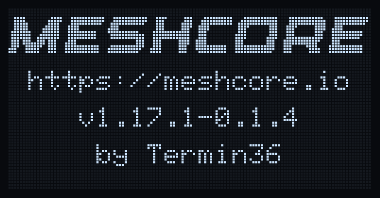

Русский текст читается. Слева — как это выглядело в оригинальной прошивке, справа — сейчас:

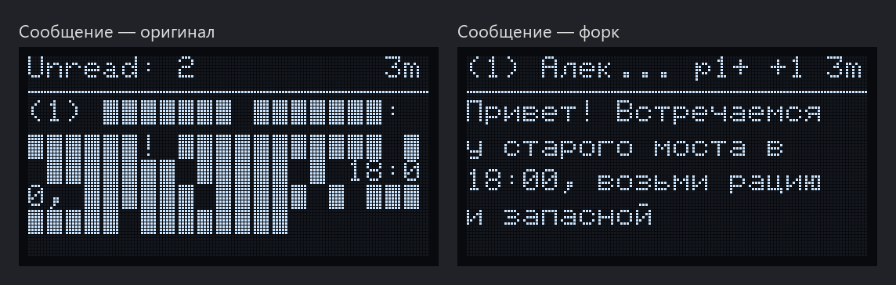

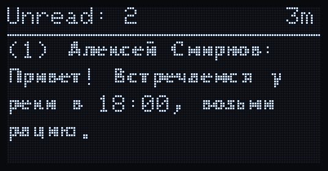

Длинные сообщения листаются страницами. В шапке метка вроде `p1+` / `p2`. Следующая страница сама через несколько секунд или по двойному нажатию. Эмодзи на экране не рисуются квадратами — на их месте пробел.

Телефон для чтения не нужен. Companion можно оставить автономно: входящие сами открываются на экране, их читают одной кнопкой и кладут обратно. С телефона в этот момент ничего отправлять нельзя — это режим только чтения.

В памяти экрана до 32 сообщений. Одно нажатие идёт к следующему, от старого к новому. В шапке видно, сколько ещё непрочитанных. Долгое нажатие помечает очередь прочитанной и возвращает на главную, но текст не стирает. Долгое нажатие уже на главной открывает ту же очередь снова, с самого старого. Три нажатия убирают текущее сообщение из памяти совсем. На высоком экране повторный просмотр подписан `Recent`, свежая очередь — `Unread`. На электронных чернилах, пока открыты часы, внизу отдельно считаются непрочитанные группы и личные чаты.

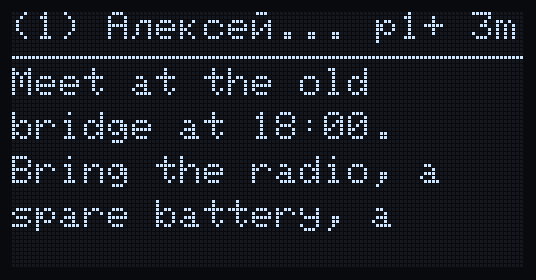
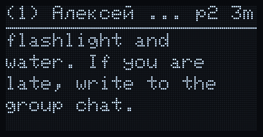
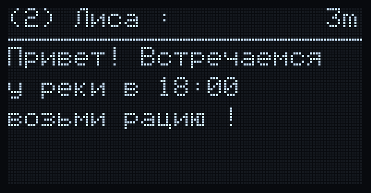

Когда часы уже выставлены, на главной странице внизу местное время, день недели и дата. Пока времени нет, эта строка не показывается. На экране 128×64 строка PIN при этом мельче, чтобы дата поместилась.

Строка `MSG: 8/3` — одна. Первое число: сколько ещё не отдано в телефон. Второе: сколько ещё лежит на самом устройстве. Когда телефон забирает сообщение, эта копия стирается и с экрана, и второе число уменьшается.

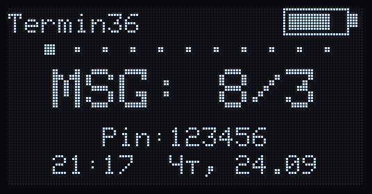
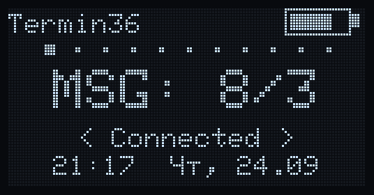

Список недавних узлов. Отдельной страницы с иконкой объявления больше нет: долгое нажатие на этом списке отправляет advert. Если список пуст, на экране `no adverts`. Пока внизу есть свободная строка, там подсказка `advert` и жест долгого нажатия.

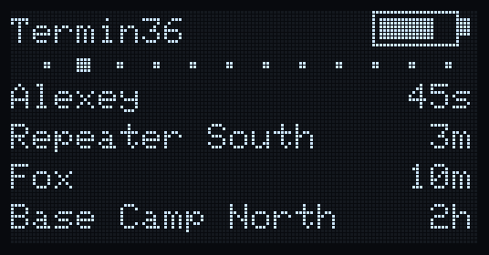

## Кнопка Companion

На большинстве плат одна пользовательская кнопка. На джойстике или энкодере «долгое нажатие» — это центр.

| Жест | Что происходит |
|---|---|
| Одно нажатие | Включить экран или следующая страница. В окне сообщения — следующее по времени, от старого к новому. На странице Setup в правке — следующая строка |
| Два нажатия | Предыдущая страница. В длинном сообщении — следующая страница текста. На странице Setup в правке — предыдущая строка |
| Долгое нажатие | Действие текущей страницы. В сообщении — прочитано и на главную, текст остаётся. На главной — открыть сохранённые сообщения снова. На странице Setup — войти в правку или выйти из неё |
| Три нажатия | В окне сообщения — стереть его из памяти экрана. На странице маяка — интервал отправки. На странице Radio — следующий профиль сети. На странице Setup в правке — сменить значение строки. В остальных местах — звук вкл/выкл |
| Четыре нажатия | На странице маяка — выключить маяк |

На Repeater одно нажатие на главном экране открывает страницу Radio. Тройное нажатие на главном экране включает и выключает внешний усилитель приёма (LNA), если он есть на плате. На странице Radio тройное нажатие меняет профиль сети, а долгое — LNA.

## Страницы Companion

Главный экран листается кнопкой. При переходе коротко показывается название страницы.

### Neighbors

Репитеры, которые слышны напрямую, по убыванию качества связи (SNR). Долгое нажатие — опросить соседей. После опроса около минуты собираются ответы: до восьми репитеров, знакомые по имени, остальные по короткому коду. Если список длинный, он прокручивается сам.

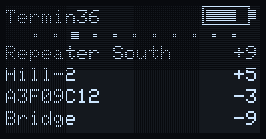
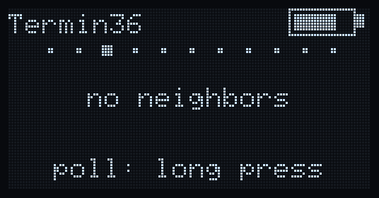

### Radio

Частота, SF, BW, CR, мощность, LNA и профиль сети. Долгое нажатие включает или выключает внешний усилитель приёма. Тройное нажатие идёт по кругу: **Long**, **HiNoise**, **Normal**.

- **Normal** — сеть, которая была до специального профиля. Если его ещё не включали, это текущие параметры или заводской пресет сборки.
- **Long** — 869.495 МГц, полоса 62.5 кГц, SF11, CR 4/5. Компаньон на этом профиле включает ретрансляцию.
- **HiNoise** — та же частота, полоса 31.25 кГц, SF10, CR 4/7. Для широкого шума на весь эфир. Ретрансляция тоже включается.

Соседи должны стоять на тех же параметрах. На экране имя профиля и подсказка `3x: profile`.

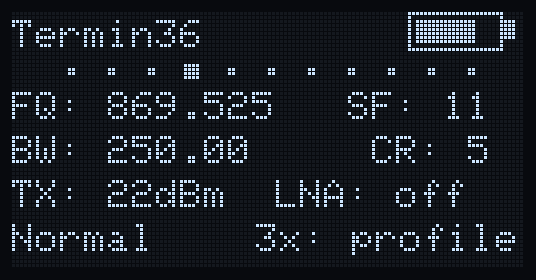
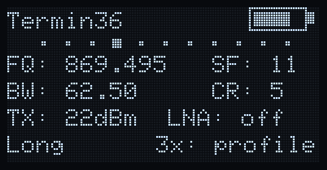
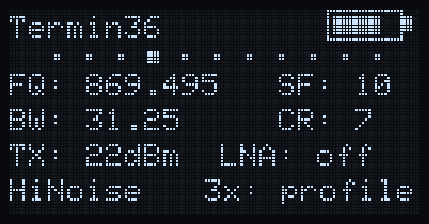

На Heltec V4, T096, Tracker V2 и Station G3 LNA **по умолчанию выключен**: в городе он часто поднимает шум. В тихом месте его можно включить здесь или профилем питания. На платах без такого усилителя будет `LNA: n/a`.

### Power

Готовые профили батареи: от самого экономного **Eco max** до самого чувствительного **Eco min**. Долгое нажатие — следующий профиль. Если настройки выставлены вручную и не совпадают с профилем, будет **Custom**.

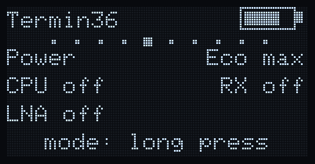
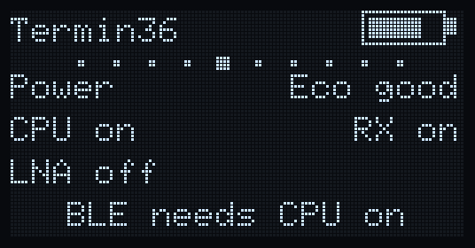

Чтобы процессор мог засыпать (ESP32: Heltec V2/V3/V4, T-Beam и похожие), погасите экран и выключите GPS и Bluetooth (или возьмите сборку USB/Wi-Fi). Иначе появится подсказка вроде `BLE needs CPU on`. На nRF52 отдельного переключателя сна нет: процессор и так отдыхает в простое.

### Noise scan

Текущий RSSI крупными цифрами, уровень шума и пик. Чем ближе к −120 dBm, тем тише эфир. Экран на этой странице не гаснет. Долгое нажатие сбрасывает пик. Во время чужого пакета пик не обновляется (метка `PKT`).

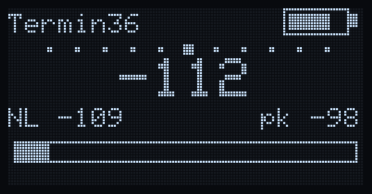

### Freq scan

Поиск более тихих частот вокруг текущей в разрешённом диапазоне (EU868 или US915). Долгое нажатие запускает поиск. На экран выводятся три самые тихие; текущая помечена `*`. **Прошивка частоту сама не меняет.** На время поиска рабочая частота не слушается. Если уйти со страницы, останется уже найденное.

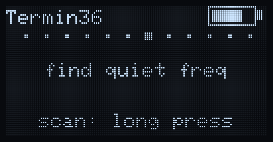
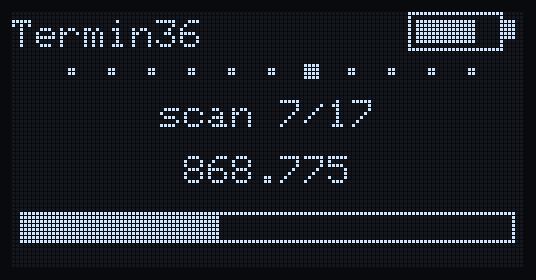
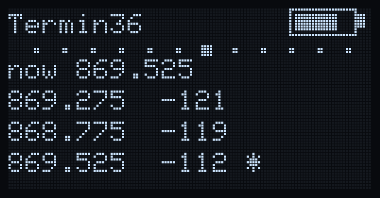

### GPS

Состояние модуля, фикс, спутники, координаты, высота. Долгое нажатие включает или выключает GPS. На MeshPocket этой страницы нет.

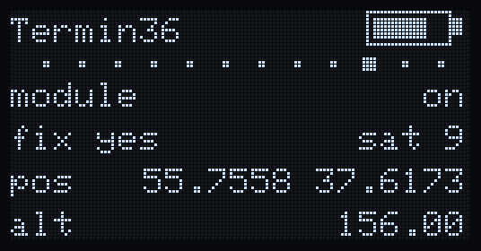

### Beacon

Автономная отправка координат без телефона. Страница есть, только если GPS найден и включён. Долгое нажатие переключает режим. GPS при включении маяка тоже включается. Первая отправка — примерно через 20 секунд после фикса. Режим и интервал запоминаются после перезагрузки.

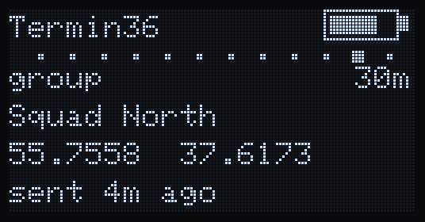
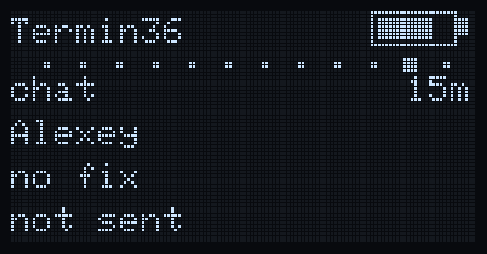
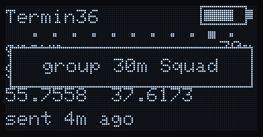

| Режим | Куда уходит позиция | Как часто |
|---|---|---|
| Выкл | Никуда | — |
| Соседям | Координаты ближайшим узлам | каждые 10 мин |
| В сеть | Координаты по сети | каждые 30 мин |
| В канал | Текст `gps широта долгота` в групповой канал | 5–120 мин, по умолчанию 30 |
| В чат | Тот же текст выбранному контакту | 5–120 мин, по умолчанию 30 |

Три нажатия на этой странице меняют интервал для канала и чата: 5 → 10 → 15 → 30 → 60 → 120 минут. Четыре нажатия выключают маяк.

В режиме чата следующее сообщение не уйдёт, пока предыдущее не подтверждено. Сообщения в канал и в чат видят участники канала или адресат — это обычный текст.

## Время

Часы нужны, чтобы на экране были дата и крупные цифры, и чтобы узел мог ответить соседу, который время ещё не знает. Пока время не выставлено, на главной странице даты нет, а на электронных чернилах вместо часов остаются `--:--`.

Время появляется из телефона, GPS или другого узла. Как только оно стоит, этот Companion или Repeater сам начинает отвечать тем, кто его спрашивает. Список `clock.node` — это не «я сервер», а «у кого спрашивать». Комнатный сервер время не раздаёт и по списку его не запрашивает.

| Откуда | Когда ставится |
|---|---|
| Телефон или консоль Companion | `set time 2026-09-24 21:17` или `clock sync` из клиента |
| GPS | Первый фикс, и только пока часы ещё пустые. Уточненные часы GPS не переписывает |
| Узел из списка | Запрос по известному маршруту. Пустые часы берут ответ как есть. Если часы уже стоят, они сдвигаются только вперёд и только когда чужое время впереди больше чем на 30 секунд |

Часовой пояс на Companion — `set tz +3` (или `+3:30`, от −14 до +14). На экране время местное, в команде `set time` тоже. День недели по умолчанию по-русски: `Чт, 24.09`. Команда `set lang en` переключает подписи на английский, `set lang ru` возвращает русские.

Список один и у Companion, и у Repeater: `set clock.node` и публичный ключ (или его начало, если оно однозначно). До 16 узлов. Список сохраняется и после перезагрузки читается обратно. `clock.node` снова показывает имена, если узел ещё есть среди контактов или соседей; иначе на этом месте `?`, а ключ остаётся. `clock.node remove 0` убирает первый, `set clock.node off` очищает список, `clock pull` спрашивает сразу.

Опрос идёт по кругу, по одному узлу за раз. Нет маршрута — берётся следующий из списка. Первый раз примерно через 20 секунд после включения, дальше каждые 2 минуты, пока время не появится, и затем каждые 6 часов. К ответу прибавляется половина времени в пути. Если часы уже стоят, они сдвигаются только вперёд и только когда чужое время впереди больше чем на 30 секунд. Шаг назад повторно использовал бы старые метки пакетов. Пустые часы в ответ не отдаются. Companion отвечает не чаще раза в 5 секунд.

Запрос — не флуд. Если путь к узлу уже известен, пакет идёт по нему, в том числе через репитеры. Если путь неизвестен, запрос уходит только к тому, кого только что слышали напрямую.

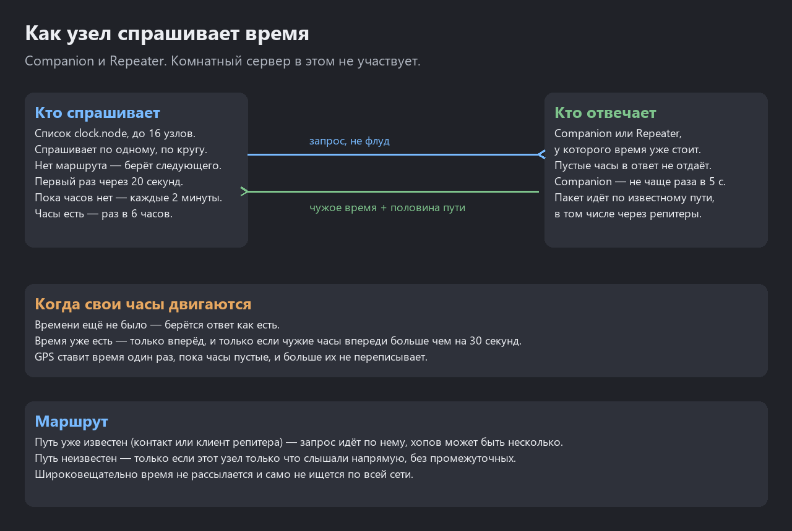

Схемы: один узел с телефоном или GPS и все остальные спрашивают его; репитер как часы района; цепочка от этого источника. Уже идущие часы назад не ходят, поэтому более медленный сосед их не перетягивает. Круг, в котором ни у кого нет времени, не заводится.

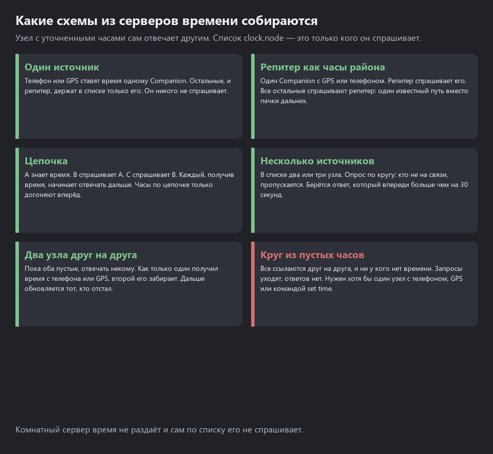

На OLED и цветном TFT дата видна на главной странице. На экране высотой 64 точки строка PIN при этом становится мельче, а адрес Wi‑Fi прячется, чтобы дата поместилась.

На электронных чернилах через минуту простоя на главной панель полностью очищается и открываются крупные часы: день и дата сверху, время по центру. Страницы соседей, шума, поиска частоты и маяка часы не перекрывают. Новое сообщение часы не закрывает: внизу счётчик непрочитанных групп и чатов. Телефон, который забирает очередь, с этих часов не уводит, но забранную копию стирает с экрана. Нажатие кнопки открывает сообщение, а если непрочитанных нет — возвращает на главную. Часы можно выключить на странице Setup: строка **Clock**, значение `off`.

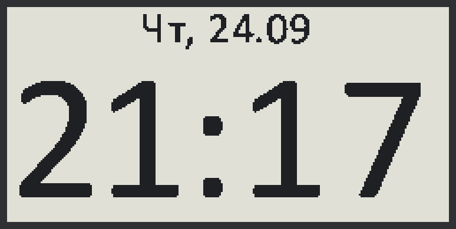
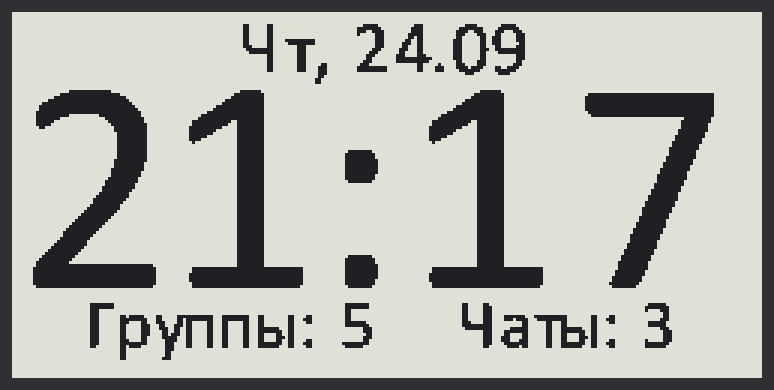

Все варианты даты и часов: [gallery_date.png](docs/screens/gallery_date.png).

### Setup

Страница есть только на электронных чернилах. На ней две строки: **Clock** и **ScreenMode**. Долгое нажатие входит в правку, тройное меняет значение выбранной строки. Настройки сохраняются после перезагрузки.

**Clock** `on` или `off` — крупные часы через минуту простоя. По умолчанию включены.

**ScreenMode** — как панель перерисовывает кадр:

| Номер | Поведение |
|---|---|
| 1 | Длинная волна, когда чёрное должно стать белым. Старые буквы и цифры стираются. На миг виден негатив изменённого места. Это режим по умолчанию |
| 2 | Короткая волна только по изменившимся пикселям. Без вспышки, но старое чёрное может остаться |
| 3 | Короткая волна, если изменилось не больше 36% панели. Большая смена кадра идёт длинной волной |

Каждые 30 коротких кадров панель всё равно полностью очищается, чтобы белый не серел. Новое сообщение и новая страница текста всегда идут длинной волной, даже в режимах 2 и 3: иначе предыдущие буквы оставались бы на стекле. Счётчик возраста в шапке сообщения остаётся коротким.

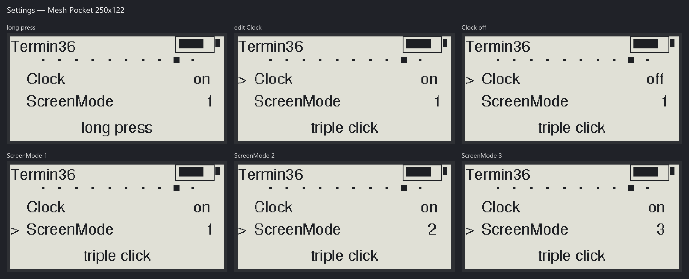

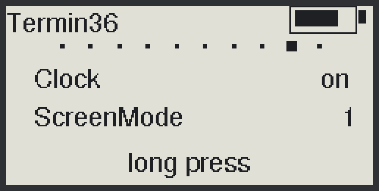

Почему короткая волна оставляет старое чёрное, и как режим 1 его стирает: [схема](docs/screens/eink_partial/why_black_stays.png), [чистая смена цифры](docs/screens/eink_partial/frames.png), [шлейф](docs/screens/eink_partial/frames_before.png).

## Цветные экраны

На цветных TFT (Heltec T096, Tracker, T-Deck и похожие) фон тёмный, шапка синяя, текст белый. Кириллица рисуется тем же шрифтом, что на OLED. На T096 обычный текст ещё и чуть крупнее: буква заполняет строку и не обрезает адрес на заставке. Слева — как экран выглядел раньше, справа — сейчас.

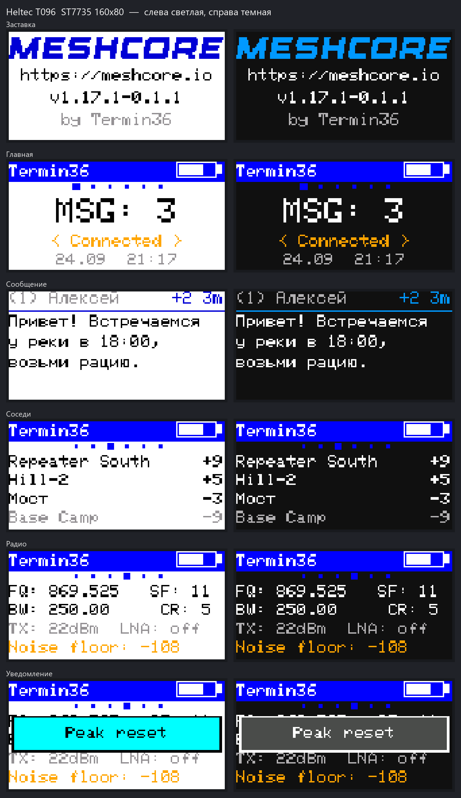

Heltec T114 остаётся чёрно-белым: цветная палитра туда не попадает, русские буквы читаются.

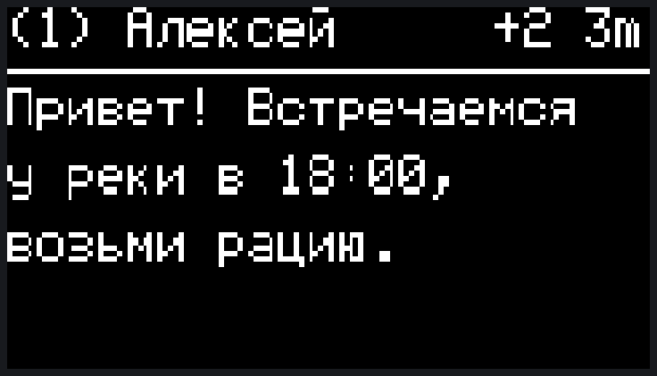

Остальные кадры: [до и после](docs/screens/tft/gallery_before_after.png), [T114](docs/screens/tft/t114.png).

## Repeater

На заставке и на главном экране репитера — заряд, частота, LNA и уровень шума. Иконка заряда не дёргается от каждого замера. Внизу подсказка: одно нажатие открывает Radio, тройное включает и выключает LNA, если он есть на плате.

На странице Radio те же три профиля, что у компаньона. Тройное нажатие идёт по кругу Long, HiNoise, Normal. Долгое нажатие на этой странице включает и выключает LNA. Одно нажатие возвращает на главный экран, следующее открывает Wi‑Fi.

Если батарея садится ниже порога выключения, репитер пишет `Low Battery` и выключается. Показание ниже 0,5 В порогом не считается: так выглядит питание от сети или сбойный замер, а не севшая ячейка.

Прошивку можно обновить без кабеля — раздел «Обновление репитера по воздуху». На ESP32 те же настройки и загрузка `.bin` есть в веб-панели.

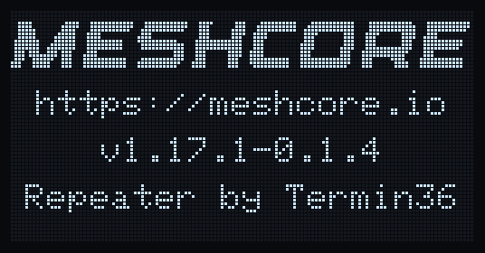
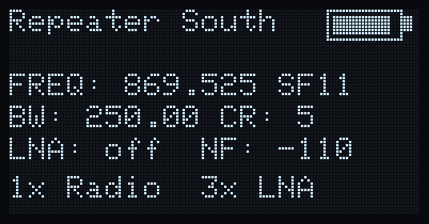
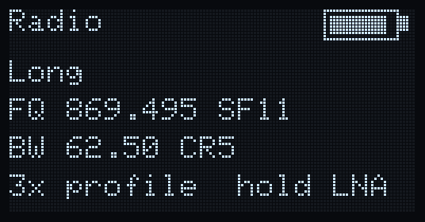
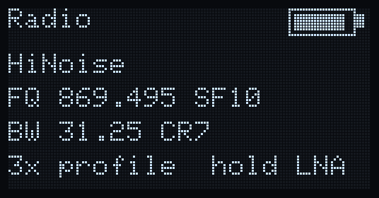
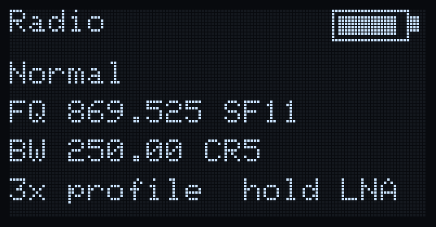
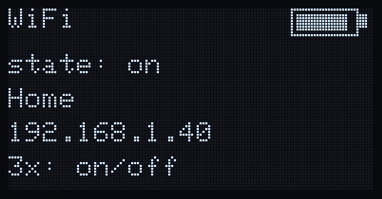

### Веб-панель

Панель открывается у репитера на ESP32, когда станция Wi‑Fi включена. Адрес написан на странице Wi‑Fi. В браузере это `http://` и этот адрес. Вход: `admin` и пароль администратора. После первой прошивки пароль часто `password`.

Живые блоки приходят по WebSocket и сами обновляются: узел, часы и объявления, радио, соседи, статистика, сеть. Ниже их можно менять.

**Настройки радио.** Профили «Обычный», «Дальний», «HiNoise» и свой набор частоты, полосы, SF и CR. Здесь же мощность, задержки, лимиты flood, path hash, обнаружение петель, ретрансляция, усиление приёма, FEM, CAD и дополнительный ACK. Смена частоты, полосы, SF или CR сохраняется и перезагружает репитер. Страница ждёт, пока он снова появится, и открывает этот блок заново. Остальные поля применяются сразу.

**Узел.** Имя, описание, широта, долгота, антенна, высота и направление уходят в объявление. Антенна: не указана, всенаправленная, коллинеар, штырь, диполь, яги, панель, магнитная, Maxon. Высота — в метрах, направление — азимут, 0° это север. Оба поля можно оставить пустыми. Локальное объявление: 0 или 60–240 минут. Flood-объявление: 0 или 3–168 часов. Ноль выключает интервал. После сохранения репитер сразу отправляет объявление, если интервал включён.

**Питание.** Без энергосбережения радио Wi‑Fi включено постоянно. Сон модема гасит его между маяками точки доступа. Сон модема и процессора дополнительно усыпляет CPU, если сборка это позволяет. MQTT при этом не выключается. Если брокер начинает отваливаться, вернитесь к первому режиму.

**Прошивка.** Файл `.bin` этой платы, без `merged` в имени. После записи репитер перезагружается, страница обновляется сама.

**Действия.** Отправить объявление, запросить соседей, подтянуть время, сбросить статистику, перезагрузить.

**Консоль.** Те же команды, что по кабелю.

### MQTT-мост

Мост подключает репитер к своему брокеру [MeshCore-MQTT](https://github.com/TERMIN36/MeshCore-MQTT). У панели две части: пользовательская `/app` и администратора `/admin`. Устройства ходят по MQTT поверх TLS на один адрес, порт `8883`.

После создания репитера панель один раз показывает строку настройки. Это base64 от JSON версии 1: адрес, порт, логин, пароль и сертификат. Её вставляют целиком в блок «Подключение MQTT», вкладка «Строка». Репитер берёт из строки эти поля и ставит топик публикации равным своему публичному ключу. Вкладка «Вручную» принимает те же поля. Порт в форме по умолчанию 8883. Пустой пароль или пустой сертификат оставляют уже записанные. Без сертификата мост не включается. Кнопка «Отключить MQTT» его гасит. На странице видны хост, порт, доступность, TLS и наличие сертификата.

Wi‑Fi задаётся отдельно, на странице Wi‑Fi или командами `set wifi.ssid`, `set wifi.password`, `set wifi on`. Свою сеть репитер не поднимает.

В консоли: `set mqtt.enabled on|off`, `set mqtt.host`, `set mqtt.port`, `set mqtt.user`, `set mqtt.pass`, `set mqtt.tunnel`, `set mqtt.tls on|off`.

### Мешкартель

MeshCoreTel — отдельный клиент, обычный TCP без TLS. Он показывает репитер на Мешкартеле.

Брокер по умолчанию `mqtt.meshcoretel.ru`, порт `1883`, логин `meshcore`, пароль `meshcore`. В веб-форме укажите этот адрес, порт, логин, пароль и код IATA, затем включите переключатель. IATA — 2–7 букв или цифр, код точки.

Статус уходит раз в 5 минут в `meshcore/<IATA>/<ключ>/status`. Принятые пакеты уходят сразу в `meshcore/<IATA>/<ключ>/packets`. Свои передачи уходят туда же, если включено «Отправлять свои передачи».

Нужен Wi‑Fi и выставленное время. Если NTP ещё выключен, включение Мешкартеля само включает его и сервер `pool.ntp.org`. Пока ответ NTP свежий, опрос времени по эфиру часы не перезаписывает. Сервер NTP меняется в блоке NTP, кнопка «Синхронизировать» спрашивает его сразу.

В консоли достаточно `set mqtt.iata <код>` или `set tel on <код>`. Выключить: `set mqtt.iata off` или `set tel off`. Свои передачи: `set tel.tx on|off`.

Wi‑Fi из консоли: `set wifi.ssid <имя>`, `set wifi.password <пароль>`, `set wifi on|off`. Питание: `set wifi.ps off`, `set wifi.ps modem`, `set wifi.ps light`. NTP: `set ntp on pool.ntp.org` или `set ntp off`.

## Электронные чернила (MeshPocket и аналоги)

Тот же интерфейс на панели 2.13" (250×122). GPS и маяка на MeshPocket нет.

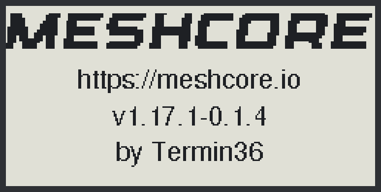
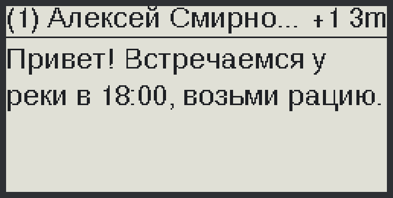
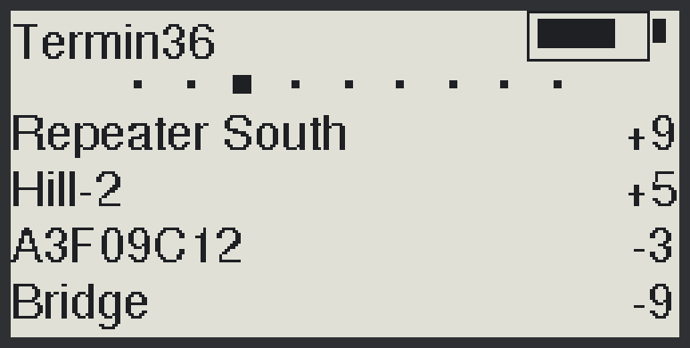
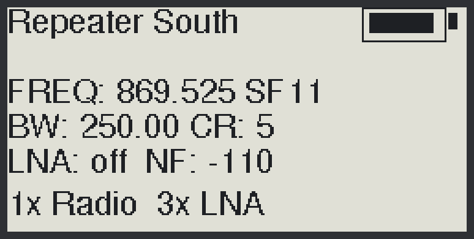
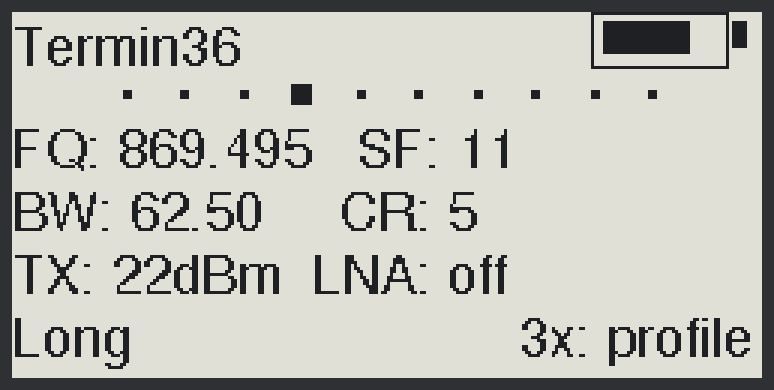
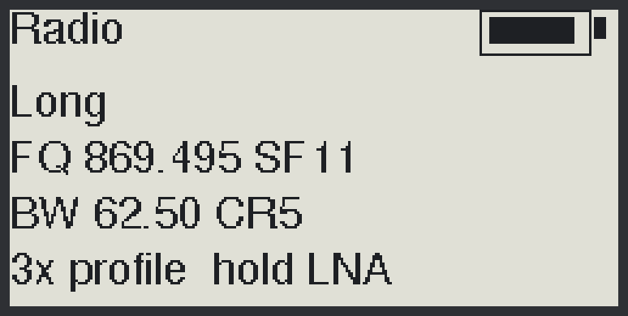
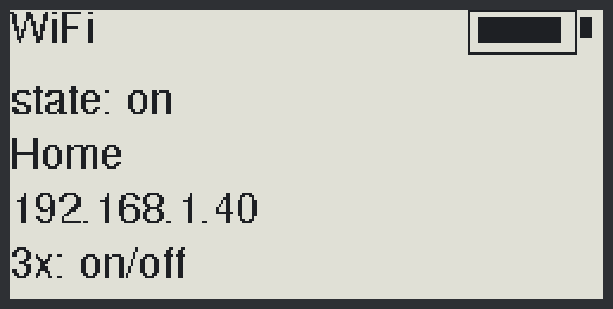

Все кадры разом: [OLED](docs/screens/gallery.png), [MeshPocket](docs/screens/gallery_meshpocket.png), [дата и часы](docs/screens/gallery_date.png). Отдельные файлы: [`docs/screens/oled`](docs/screens/oled), [`docs/screens/meshpocket`](docs/screens/meshpocket), [`docs/screens/tft`](docs/screens/tft).

## Как прошить

Готовые файлы — на странице [Releases](https://github.com/TERMIN36/MeshCore/releases/latest). В имени файла — плата и роль, например `heltec_v4_companion_radio_ble-…`.

| Окончание файла | Когда брать |
|---|---|
| `-merged.bin` | ESP32, **первая установка** или переход с другой прошивки. Память стирается, ключи и контакты сбрасываются |
| `.bin` | ESP32, **обновление** этой же прошивки. Настройки, контакты и ключи сохраняются |
| `.zip` | nRF52 (RAK, T114, T-Echo и похожие), прошивка через DFU |

Сборки есть для плат **с экраном**. Платы без дисплея в релизах не публикуются.

1. Подключите устройство USB-кабелем **с передачей данных** (не только зарядным).
2. На компьютере откройте Chrome или Edge и [прошивальщик Мешкартеля](https://meshcoretel.ru/ru/flasher). Firefox, Safari и телефоны не подходят.
3. В блоке **«Кастомная прошивка»** выберите скачанный файл. Готовые прошивки из списка устройств — это другая сборка, без этих экранов.
4. Чекбокс **«Очистить устройство»**: для `-merged.bin` включится сам (это нормально). Для обычного `.bin` его нужно **выключить**, иначе плата может не загрузиться — тогда прошейте `-merged.bin`.
5. Нажмите **«Прошить»**, выберите COM-порт и дождитесь **«Прошивка завершена»**. Не отключайте кабель.
6. Для nRF52 берите `.zip`. Если плата не отвечает, переведите её в DFU кнопкой **«Войти в DFU»** или двойным нажатием Reset и повторите.

Если порта нет в списке: зажмите **BOOT** (на Heltec V4 это `PRG`/`USER`), нажмите и отпустите **RST**, отпустите BOOT и снова нажмите «Прошить».

## Обновление репитера по воздуху

Репитер на крыше или в щитке можно обновить, не снимая его и не подключая кабель. Рядом с устройством нужен телефон или компьютер: команда уходит по сети MeshCore, а сам файл — по Wi‑Fi или Bluetooth на несколько метров.

В клиенте откройте репитер, войдите с паролем администратора и в командной строке отправьте `start ota`. Сразу после прошивки пароль часто `password`. Если кабель всё же подключён, ту же команду принимает **«Консоль»** на странице прошивальщика. Пока режим включён, устройство не засыпает. Имя, частота и пароль остаются.

| Плата | Что происходит | Какой файл |
|---|---|---|
| ESP32 (Heltec V3, V4 и другие с Wi‑Fi) | Открытая точка доступа `MeshCore-OTA`. В ответе адрес страницы, обычно `http://192.168.4.1/update` | `.bin` из релиза, через браузер |
| nRF52 (RAK, T114, T-Echo и похожие) | Bluetooth. В ответе `OK` и MAC-адрес, имя в эфире вроде `RAK4631_OTA` | `.zip` из релиза, приложение nRF Device Firmware Update |

**ESP32.** Подключитесь к сети `MeshCore-OTA` и откройте адрес из ответа. Загрузите `.bin` этой платы с ролью `repeater` — тот же файл, что для обновления по кабелю. Дождитесь окончания загрузки: репитер перезагрузится сам. Точка доступа без пароля и работает до перезагрузки. Если загрузку решили отложить, перезагрузите устройство.

**nRF52.** На телефон поставьте приложение **nRF Device Firmware Update** (Android и iOS). В его настройках включите подтверждение пакетов и укажите 8 пакетов. Выберите `.zip` из релиза и устройство с именем `…_OTA`. Если его нет в списке, включите принудительное сканирование. Загрузка занимает несколько минут.

Ответ `Error` значит, что на этой плате обновления по воздуху нет. Тогда прошивайте по кабелю. Если загрузка оборвалась, на устройстве остаётся прежняя прошивка: перезагрузите его и повторите. У комнатного сервера команда та же.

## Первый запуск

**Companion.** Откройте клиент: [веб](https://app.meshcore.nz), [Android](https://play.google.com/store/apps/details?id=com.liamcottle.meshcore.android), [iOS](https://apps.apple.com/us/app/meshcore/id6742354151?platform=iphone) или [meshcore-cli](https://github.com/fdlamotte/meshcore-cli). Найдите устройство, введите PIN с экрана.

**Repeater / Room Server.** На странице прошивальщика есть **«Настройка Репитера»** и **«Консоль»**. Также подходит [config.meshcore.io](https://config.meshcore.io).

**Частота и параметры радио** должны совпадать с вашей местной сетью. Актуальные значения — на [meshcoretel.ru](https://meshcoretel.ru/ru). Для Москвы это сейчас, например, 868.731 МГц, полоса 62.5 кГц, SF 7, CR 7 — перед настройкой сверьтесь с сайтом.

После первой прошивки с очисткой у узла новые ключи и пустой список контактов. После обновления через `.bin` всё остаётся.

## Типовые задачи

**Слышит ли узел репитеры.** Страница **Neighbors** → долгое нажатие → подождать несколько секунд. В списке будут соседи и SNR.

**Тихо ли в точке установки.** Страница **Noise scan**. Для сравнения включите и выключите LNA долгим нажатием на **Radio**: если шум вырос, а пакеты лучше не принимаются, LNA лучше оставить выключенным.

**Перейти на дальний профиль или HiNoise.** Страница **Radio**, три нажатия. Соседи должны стоять на тех же параметрах. **Normal** возвращает сеть, которая была до этого.

**Есть ли частота потише.** Страница **Freq scan** → долгое нажатие. Если в топе другая частота, её можно выставить в приложении. Все узлы вашей группы должны работать на одной частоте.

**Беречь батарею.** На **Power** выберите **Eco max**, выключите Bluetooth и GPS, дайте экрану погаснуть.

**Передавать позицию без телефона.** Включите GPS, откройте **Beacon**, долгими нажатиями выберите режим. Три нажатия — интервал, четыре — выключить.

**Поставить время.** В консоли клиента: `set tz +3`, затем `set time 2026-09-24 21:17`. Либо дождитесь фикса GPS, либо добавьте узел с уже идущими часами: `set clock.node` и его ключ. На электронных чернилах крупные часы появятся сами через минуту простоя на главной. Выключить их: страница **Setup**, **Clock** `off`.

**Убрать шлейф букв на электронных чернилах.** Страница **Setup**, **ScreenMode** `1`. Режим `2` рисует без вспышки, но старое чёрное может остаться. Режим `3` включает длинную волну только когда меняется большая часть панели.

## Что на каких платах работает

Прошивка проверяется на Heltec V4, но ставится и на другие устройства с экраном.

| Возможность | Где есть |
|---|---|
| Чтение сообщений без телефона | Companion с экраном. До 32 сообщений, очередь можно открыть снова с главной |
| Новые страницы Companion | Companion с экраном |
| Русский текст | OLED, цветные TFT, чёрно-белый T114 и электронные чернила |
| Дата на главной | OLED и цветной TFT, когда часы выставлены |
| Крупные часы | Электронные чернила, через минуту простоя на главной. Выключаются на странице Setup |
| Страница Setup | Только электронные чернила: часы и режим перерисовки |
| Стирание старых букв на чернилах | ScreenMode `1` по умолчанию. Режимы `2` и `3` чаще оставляют шлейф |
| Тёмная тема | Цветные TFT (T096, Tracker, T-Deck и похожие) |
| Включение LNA с кнопки | Heltec V4, T096, Tracker V2, Station G3. У компаньона — долгое нажатие на Radio, у репитера — тройное на главном экране или долгое на странице Radio |
| Профили радио Long, HiNoise, Normal | Companion и Repeater с экраном: тройное нажатие на странице Radio. Тот же выбор в веб-панели репитера |
| Веб-панель репитера | ESP32 с Wi‑Fi. Адрес на странице Wi‑Fi, вход `admin` и пароль администратора |
| MQTT-мост | Репитер на ESP32 и брокер [MeshCore-MQTT](https://github.com/TERMIN36/MeshCore-MQTT). Строка настройки из панели `/app`, TLS, порт 8883. Топик — публичный ключ |
| Мешкартель | Репитер на ESP32. Брокер `mqtt.meshcoretel.ru:1883`, логин и пароль `meshcore`, код IATA. Статус раз в 5 минут, пакеты сразу |
| Сон процессора | ESP32 |
| Маяк координат | Платы с GPS; страница появляется, когда GPS найден и включён |
| Запрос времени у узла | Companion и Repeater. Путь уже известен, в том числе через репитеры |
| Обновление репитера без кабеля | ESP32 с Wi‑Fi (точка `MeshCore-OTA`); nRF52 по Bluetooth |
| BME280 | Репитер LilyGO T-Beam 1W, если датчик есть на плате: температура, влажность, давление в телеметрии |

## Важно знать

- На экране русский алфавит (А–Я, Ё, ё). Символы без глифа, в том числе эмодзи, на экране не рисуются.
- Дата и крупные часы появляются только после того, как время выставлено. Уже идущие часы сдвигаются только вперёд, если источник впереди больше чем на 30 секунд. Узел без времени другим его не раздаёт. Комнатный сервер в опросе часов не участвует. На электронных чернилах крупные часы выключаются строкой Clock на странице Setup.
- На электронных чернилах режим 1 стирает старое чёрное длинной волной и на миг показывает негатив изменённого места. Режимы 2 и 3 этого не делают на каждом кадре, поэтому предыдущая цифра или буква может остаться. Новое сообщение всё равно рисуется длинной волной.
- Поиск частоты на несколько секунд занимает радио: в это время рабочая частота не слушается.
- Маяк в канал и в чат шлёт обычные текстовые сообщения.
- После первой прошивки приём на платах с LNA может отличаться от заводской MeshCore: усилитель по умолчанию выключен. В тихом эфире его можно включить.
- Профили Long и HiNoise меняют частоту, полосу, SF и CR. Узлы на обычной сети их не услышат, пока сами не перейдут на тот же профиль. У компаньона на этих двух профилях включается ретрансляция.

Устройство с этой прошивкой работает в одной сети с узлами на обычном MeshCore: радиопротокол тот же.

## Лицензия

Как и оригинальный MeshCore, проект под лицензией MIT: можно свободно использовать, изменять и распространять, в том числе в коммерческих целях.
